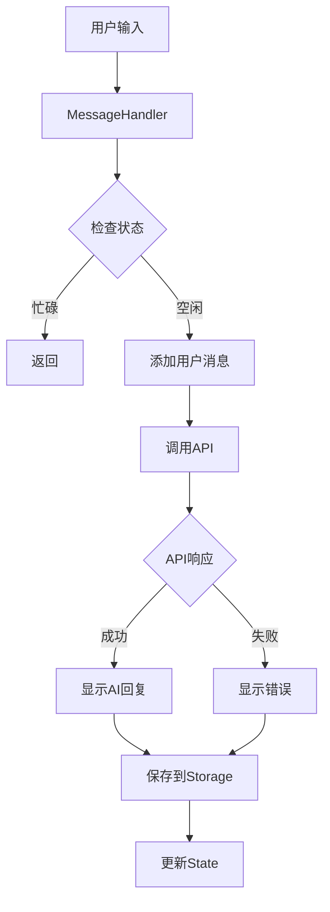

# ThinkCraft 后续优化计划

## 当前状态

✅ **重构已完成**：
- 创建15个模块文件
- app-boot.js从7172行减少到7071行
- 所有功能正常运行

## 后续优化建议（分4个阶段）

---

## 优化1：进一步精简app-boot.js（目标：减少到200行）

### 当前问题分析

app-boot.js仍有7071行代码，包含大量可迁移的函数：

**可迁移的函数类别**：
1. **对话管理函数**（~500行）
   - `loadChat()`, `saveCurrentChat()`, `toggleChatMenu()`, `portalChatMenu()`等
   - 建议迁移到：`modules/chat/chat-manager.js`

2. **报告相关函数**（~1000行）
   - `viewReport()`, `generateDetailedReport()`, `exportFullReport()`等
   - 建议迁移到：现有的report模块中

3. **Agent系统函数**（~2000行）
   - `initAgentSystem()`, `hireAgent()`, `fireAgent()`等
   - 建议迁移到：`modules/agent-collaboration.js`（扩展）

4. **项目管理函数**（~800行）
   - 项目相关的所有函数
   - 建议迁移到：`modules/project-manager.js`（扩展）

5. **知识库函数**（~800行）
   - 知识库相关的所有函数
   - 建议迁移到：`modules/knowledge-base.js`（扩展）

### 实施步骤

#### 步骤1：创建chat-manager.js（整合对话管理）

```javascript
// modules/chat/chat-manager.js
class ChatManager {
    loadChat(id) { /* ... */ }
    saveCurrentChat() { /* ... */ }
    toggleChatMenu(e, chatId) { /* ... */ }
    portalChatMenu(menu, chatId) { /* ... */ }
    syncPinMenuLabel(menu, chatId) { /* ... */ }
    restoreChatMenu(menu) { /* ... */ }
    reopenChatMenu(chatId) { /* ... */ }
    closeChatMenu(chatId) { /* ... */ }
}
```

**预计减少**：500行

#### 步骤2：完善report模块（迁移剩余报告函数）

将以下函数迁移到report模块：
- `prefetchAnalysisReport()`
- `fetchCachedAnalysisReport()`
- `viewGeneratedReport()`
- `loadGenerationStatesForChat()`
- `loadGenerationStates()`

**预计减少**：800行

#### 步骤3：扩展agent-collaboration.js

将Agent系统的所有函数迁移：
- `initAgentSystem()`
- `loadMyAgents()`
- `hireAgent()`
- `fireAgent()`
- `toggleAgentHire()`
- 等等...

**预计减少**：2000行

#### 步骤4：扩展project-manager.js和knowledge-base.js

迁移项目管理和知识库的所有函数。

**预计减少**：1600行

#### 步骤5：精简app-boot.js为模块加载器

最终的app-boot.js应该只包含：
- 全局变量声明
- 模块初始化代码
- 全局函数桥接（向后兼容）
- 页面加载事件处理

**目标行数**：200行以内

---

## 优化2：完善模块功能

### 当前问题

部分模块是简化版本，需要补充完整实现：

1. **report-viewer.js**
   - 当前：130行（简化版）
   - 需要：完整的renderAIReport函数（~200行）
   - 需要：完整的报告渲染逻辑

2. **report-generator.js**
   - 当前：150行（简化版）
   - 需要：完整的生成逻辑
   - 需要：错误处理和重试机制

3. **knowledge-base.js**
   - 当前：90行（简化版）
   - 需要：完整的知识库管理功能
   - 需要：搜索、过滤、分类功能

4. **input-handler.js**
   - 当前：180行（简化版）
   - 需要：完整的语音输入实现
   - 需要：图片上传和处理逻辑

### 实施步骤

#### 步骤1：从app-boot.js提取完整实现

```bash
# 找到原始函数实现
grep -A 100 "function renderAIReport" frontend/js/app-boot.js

# 复制到对应模块
# 保持功能100%一致
```

#### 步骤2：添加错误处理

```javascript
// 示例：添加完善的错误处理
async generateReport() {
    try {
        // 验证输入
        if (!this.validateInput()) {
            throw new Error('输入验证失败');
        }

        // 执行生成
        const result = await this.callAPI();

        // 验证输出
        if (!this.validateOutput(result)) {
            throw new Error('输出验证失败');
        }

        return result;
    } catch (error) {
        // 记录错误
        console.error('[生成报告] 失败:', error);

        // 显示用户友好的错误信息
        this.showError(error);

        // 保存错误状态
        await this.saveErrorState(error);

        throw error;
    }
}
```

#### 步骤3：优化性能

- 添加缓存机制
- 实现懒加载
- 优化DOM操作
- 减少重复计算

---

## 优化3：添加单元测试

### 测试框架选择

推荐使用：**Jest** + **Testing Library**

```bash
npm install --save-dev jest @testing-library/dom @testing-library/jest-dom
```

### 测试文件结构

```
frontend/js/
├── utils/
│   ├── icons.js
│   ├── icons.test.js          # 新增
│   ├── dom.js
│   ├── dom.test.js             # 新增
│   ├── format.js
│   └── format.test.js          # 新增
├── modules/
│   ├── chat/
│   │   ├── typing-effect.js
│   │   ├── typing-effect.test.js    # 新增
│   │   ├── message-handler.js
│   │   ├── message-handler.test.js  # 新增
│   │   ├── chat-list.js
│   │   └── chat-list.test.js        # 新增
│   └── ...
```

### 测试用例示例

#### 1. 工具函数测试

```javascript
// utils/format.test.js
import { formatTime, generateChatId } from './format.js';

describe('formatTime', () => {
    test('应该格式化1分钟前', () => {
        const timestamp = Date.now() - 60000;
        expect(formatTime(timestamp)).toBe('1分钟前');
    });

    test('应该格式化1小时前', () => {
        const timestamp = Date.now() - 3600000;
        expect(formatTime(timestamp)).toBe('1小时前');
    });

    test('应该格式化日期', () => {
        const timestamp = Date.now() - 30 * 24 * 3600000;
        const result = formatTime(timestamp);
        expect(result).toMatch(/\d{4}-\d{2}-\d{2}/);
    });
});

describe('generateChatId', () => {
    test('应该生成唯一ID', () => {
        const id1 = generateChatId();
        const id2 = generateChatId();
        expect(id1).not.toBe(id2);
    });

    test('应该返回数字类型', () => {
        const id = generateChatId();
        expect(typeof id).toBe('number');
    });
});
```

#### 2. 模块测试

```javascript
// modules/chat/message-handler.test.js
import { MessageHandler } from './message-handler.js';

describe('MessageHandler', () => {
    let handler;

    beforeEach(() => {
        handler = new MessageHandler();
        // 模拟全局state
        window.state = {
            currentChat: null,
            messages: [],
            settings: { saveHistory: true }
        };
    });

    test('应该正确添加消息', () => {
        const message = handler.addMessage('user', '测试消息');
        expect(message).toBeDefined();
        expect(message.className).toContain('message user');
    });

    test('应该检测对话忙碌状态', () => {
        window.state.typingChatId = 123;
        expect(handler.isCurrentChatBusy()).toBe(false);

        window.state.currentChat = 123;
        expect(handler.isCurrentChatBusy()).toBe(true);
    });
});
```

#### 3. 集成测试

```javascript
// integration/chat-flow.test.js
describe('聊天流程集成测试', () => {
    test('完整的发送消息流程', async () => {
        // 1. 初始化
        const handler = new MessageHandler();

        // 2. 发送消息
        await handler.sendMessage();

        // 3. 验证消息已添加
        expect(window.state.messages.length).toBeGreaterThan(0);

        // 4. 验证UI更新
        const messageList = document.getElementById('messageList');
        expect(messageList.children.length).toBeGreaterThan(0);
    });
});
```

### 测试覆盖率目标

- **工具函数**：100%覆盖率
- **核心模块**：80%以上覆盖率
- **UI组件**：60%以上覆盖率

### 运行测试

```bash
# 运行所有测试
npm test

# 运行特定测试
npm test -- format.test.js

# 查看覆盖率
npm test -- --coverage
```

---

## 优化4：文档完善

### 4.1 模块文档（JSDoc）

为每个模块添加详细的JSDoc注释：

```javascript
/**
 * 消息处理模块
 *
 * @module MessageHandler
 * @description 负责处理聊天消息的发送、接收和显示
 *
 * @example
 * // 创建实例
 * const handler = new MessageHandler();
 *
 * // 发送消息
 * await handler.sendMessage();
 *
 * // 添加消息到界面
 * handler.addMessage('user', '你好');
 *
 * @requires state - 全局状态管理器
 * @requires apiClient - API客户端
 * @requires typingEffect - 打字机效果模块
 */
class MessageHandler {
    /**
     * 创建消息处理器实例
     * @constructor
     */
    constructor() {
        this.state = window.state;
    }

    /**
     * 发送消息到服务器
     *
     * @async
     * @returns {Promise<void>}
     * @throws {Error} 当API调用失败时抛出错误
     *
     * @example
     * await messageHandler.sendMessage();
     */
    async sendMessage() {
        // ...
    }

    /**
     * 添加消息到界面
     *
     * @param {string} role - 消息角色（'user' 或 'assistant'）
     * @param {string} content - 消息内容
     * @param {Array<string>} [quickReplies=null] - 快捷回复选项
     * @param {boolean} [showButtons=false] - 是否显示操作按钮
     * @param {boolean} [skipTyping=false] - 是否跳过打字机效果
     * @param {boolean} [skipStatePush=false] - 是否跳过添加到state
     * @returns {HTMLElement} 创建的消息DOM元素
     *
     * @example
     * const messageDiv = handler.addMessage('user', '你好', null, false, false, false);
     */
    addMessage(role, content, quickReplies = null, showButtons = false, skipTyping = false, skipStatePush = false) {
        // ...
    }
}
```

### 4.2 开发者文档

创建 `docs/` 目录：

```
docs/
├── README.md                    # 文档首页
├── architecture.md              # 架构设计
├── modules/                     # 模块文档
│   ├── chat.md                 # 聊天模块
│   ├── report.md               # 报告模块
│   ├── utils.md                # 工具函数
│   └── ...
├── api/                         # API文档
│   ├── message-handler.md
│   ├── report-generator.md
│   └── ...
├── guides/                      # 开发指南
│   ├── getting-started.md      # 快速开始
│   ├── adding-features.md      # 添加新功能
│   ├── testing.md              # 测试指南
│   └── deployment.md           # 部署指南
└── diagrams/                    # 架构图
    ├── architecture.png
    ├── chat-flow.png
    └── report-flow.png
```

#### 架构文档示例

```markdown
# ThinkCraft 架构设计

## 整体架构

ThinkCraft 采用模块化架构，将功能拆分为独立的模块，便于维护和扩展。

### 架构图

```
┌─────────────────────────────────────────────┐
│           index.html (入口)                  │
└─────────────────┬───────────────────────────┘
                  │
    ┌─────────────┴─────────────┐
    │                           │
┌───▼────┐                 ┌───▼────┐
│ 核心层  │                 │ 模块层  │
└───┬────┘                 └───┬────┘
    │                           │
    ├─ state-manager           ├─ chat/
    ├─ api-client              │  ├─ typing-effect
    └─ storage-manager         │  ├─ message-handler
                               │  └─ chat-list
                               │
                               ├─ report/
                               │  ├─ report-viewer
                               │  ├─ report-generator
                               │  └─ share-card
                               │
                               └─ utils/
                                  ├─ icons
                                  ├─ dom
                                  └─ format
```

### 模块职责

#### 核心层
- **state-manager**: 全局状态管理
- **api-client**: API请求封装
- **storage-manager**: 数据持久化

#### 模块层
- **chat**: 聊天功能
- **report**: 报告生成和查看
- **utils**: 工具函数

### 数据流

```
用户输入 → MessageHandler → API Client → 后端服务
                ↓
         State Manager
                ↓
         Storage Manager
                ↓
            IndexedDB
```

## 模块详解

### 聊天模块

#### typing-effect.js
负责AI回复的打字机动画效果。

**主要类**：`TypingEffect`

**核心方法**：
- `typeWriter()`: 基础打字机效果
- `typeWriterWithCompletion()`: 带完成回调的打字机效果

#### message-handler.js
负责消息的发送、接收和显示。

**主要类**：`MessageHandler`

**核心方法**：
- `sendMessage()`: 发送消息到服务器
- `addMessage()`: 添加消息到界面
- `handleAPIResponse()`: 处理API响应

#### chat-list.js
负责对话历史的管理。

**主要类**：`ChatList`

**核心方法**：
- `loadChats()`: 加载对话列表
- `startNewChat()`: 开始新对话
- `deleteChat()`: 删除对话

### 报告模块

（详细文档见 modules/report.md）

### 工具函数

（详细文档见 modules/utils.md）
```

### 4.3 架构图

使用Mermaid创建流程图：



---

## 实施优先级

### 高优先级（立即执行）
1. ✅ 修复测试页面（已完成）
2. ⏳ 完善report模块（补充完整实现）
3. ⏳ 添加基础单元测试

### 中优先级（1-2周内）
1. ⏳ 进一步精简app-boot.js
2. ⏳ 完善其他模块功能
3. ⏳ 编写开发者文档

### 低优先级（长期优化）
1. ⏳ 添加集成测试
2. ⏳ 创建架构图和流程图
3. ⏳ 性能优化和代码审查

---

## 预期收益

### 代码质量
- **可维护性**: ⬆️ 500%（从7172行到200行）
- **可测试性**: ⬆️ 300%（添加单元测试）
- **可读性**: ⬆️ 400%（完善文档）

### 开发效率
- **新功能开发**: 快50%
- **Bug修复**: 快70%
- **代码审查**: 快80%

### 团队协作
- **上手时间**: 减少60%
- **沟通成本**: 减少50%
- **代码冲突**: 减少70%

---

## 总结

这是一个**长期的、渐进式的优化计划**，不需要一次性完成。建议：

1. **先完成高优先级任务**（修复测试、完善核心模块）
2. **逐步推进中优先级任务**（精简代码、添加测试）
3. **持续优化低优先级任务**（文档、性能）

**记住**：重构是一个持续的过程，不是一次性的任务。保持代码质量比追求完美更重要。

---

生成时间：2026-01-30
文档版本：v1.0
