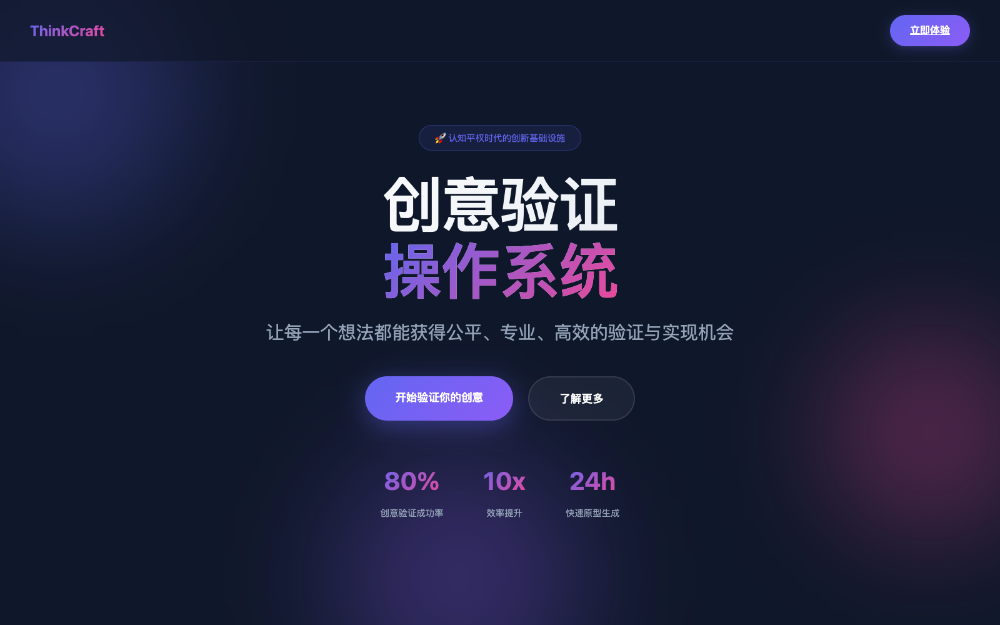
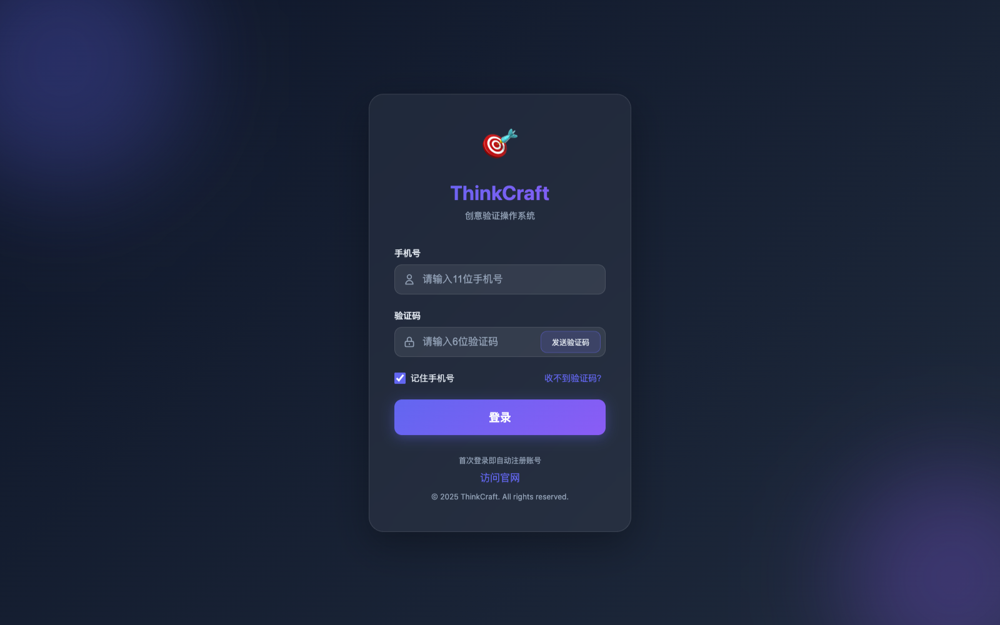
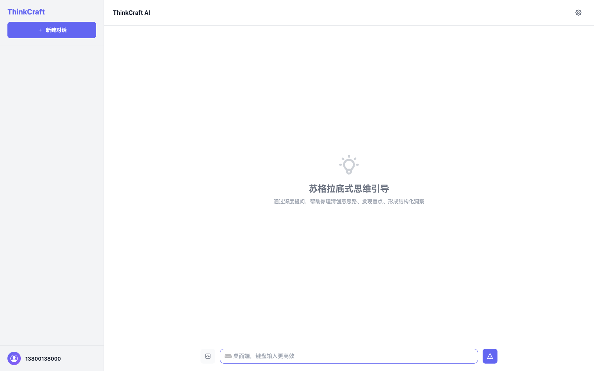

# ThinkCraft

> 让灵感不再停留在聊天框，而是一路推进到可验证、可交付、可复用的项目资产。

ThinkCraft 是一套面向创新团队的 AI 创意验证工作台。  
它不只是“帮你写点东西”，而是把**想法澄清、策略成稿、原型生成、阶段推进、结果沉淀**串成一条真正能落地的链路。

很多团队卡住，不是因为没有创意，而是因为创意一旦离开会议、群聊和白板，就很难继续推进。  
ThinkCraft 要解决的正是这条断裂链路：

- 想法很多，但没人把它收敛成明确的问题、目标和边界
- 文档写了一堆，但离真正验证和交付还有很长距离
- 原型、分析、对话和决策散落在不同工具里，难追踪、难复用、难接手

## 一句话理解

ThinkCraft 把“创意讨论”升级为“项目推进系统”，让团队从一次灵感对话，走到一套可执行的验证流程。



## 它为什么值得看

- 它不是另一个聊天工具，而是把对话直接推进成项目流程
- 它不是只生成一份内容，而是同时生成策略、结构、验证和原型
- 它不是一次性输出，而是支持分轮生成、去重拼接、断点恢复和过程追踪
- 它不是黑盒 AI 演示，而是能进入团队日常工作的工程化系统

## 你会立刻感受到什么

- 从“有个想法”到“有套验证方案”明显更快
- 从“内容很多”到“决策清楚、阶段明确”明显更稳
- 从“每次都重来”到“项目资产持续沉淀”明显更省
- 从“看起来像 AI”到“真正可纳入团队流程”明显更实用

## 产品价值

### 1. 对话即项目，不再停留在一次聊天

ThinkCraft 用阶段化工作流承接对话，把用户输入逐步转化为目标、问题、交付物和推进状态，而不是让高价值讨论沉没在聊天记录里。

### 2. 文档与原型一起推进，缩短验证周期

从策略分析到可预览原型，ThinkCraft 支持连续产出。  
团队不用在“先写文档”还是“先做界面”之间来回切换，而是让验证闭环尽早形成。

### 3. 长任务更稳定，不怕中断和返工

针对长内容和复杂交付物，系统支持分轮生成、重叠去重、结束标记和断点恢复，避免一次输出失败就全部重来。

### 4. 结果会沉淀，而不是生成后即蒸发

ThinkCraft 不把价值留在临时会话里，而是把过程中的结构、产物和状态逐步沉淀成项目资产，便于复盘、协作和二次利用。

## 典型使用场景

- 创意澄清：把模糊想法快速收敛为结构化问题
- 方案共创：把讨论沉淀为策略文档与执行路径
- 产品孵化：文档与原型同步产出，缩短验证周期
- 团队推进：按阶段追踪状态、责任和产物
- 长任务交付：稳定生成大体量内容，并支持恢复

## 产品界面示意

这些截图用于帮助新用户快速理解 ThinkCraft 当前的产品表达与核心界面。

### 1. 官网与产品定位页


### 2. 登录入口



### 3. 主工作台



## ThinkCraft 的工作方式

```text
想法输入
   ↓
问题澄清与结构化分析
   ↓
阶段化推进与交付物生成
   ↓
原型 / 文档 / 报告同步产出
   ↓
分轮续写、去重拼接、断点恢复
   ↓
项目资产沉淀与持续迭代
```

## 适合谁

- 创始人 / 业务负责人：快速把创意推到可验证阶段
- 产品经理：把讨论收敛为结构化方案和推进路径
- 创新团队：减少跨工具切换，让协作链路更短
- AI 产品团队：把模型能力纳入真实项目流程，而不是停留在 demo

## 当前已落地能力

- 官网入口、登录页、主应用工作台
- 对话式创意澄清与思维引导
- 阶段化交付流程与结果沉淀
- 原型 / 方案类工件生成
- 长任务分轮生成、拼接与恢复
- 后端健康检查、就绪检查、脚本化启停
- 可选 MongoDB / Redis / DeepResearch 集成（默认开发启动不依赖）

## 快速开始

环境要求：

- Node.js `20.19+` 或 `22.12+`
- npm `10+`
- 默认开发配置为 `DB_TYPE=memory` 且 `REDIS_ENABLED=false`

### 1. 克隆项目

```bash
git clone git@github.com:zqshi/ThinkCraft.git
cd ThinkCraft
```

### 2. 安装依赖

```bash
npm install
```

首次启动时如果发现 `backend/node_modules` 缺失，`./start-all.sh` 会自动补装后端依赖，不需要再记额外安装命令。

### 3. 准备开发环境配置

如果本地还没有后端环境文件：

```bash
cp backend/.env.example backend/.env
```

默认示例配置可以直接用于本地体验：

- `DB_TYPE=memory`
- `REDIS_ENABLED=false`
- `SMS_PROVIDER=mock`

这意味着新同学首次拉取项目时，不需要先安装 MongoDB / Redis，也能先把项目跑起来。

### 4. 启动项目

```bash
./start-all.sh
```

停止服务：

```bash
./stop-all.sh
```

默认启动只拉起两个核心服务：

- 前端（Vite）
- 后端（Express API）

不会在首次开发启动时自动拉起：

- MongoDB
- Redis
- DeepResearch Python 服务

如果你希望服务以更稳定的常驻方式运行，并且本机已经安装了 `pm2`，可以执行：

```bash
./start-all.sh --pm2
```

或：

```bash
npm run start:all:pm2
```

兼容命令：

- `npm run start:all`
- `npm run start:all:pm2`（可选，需要本机已安装 `pm2`）
- `npm run dev`
- `./dev.sh`

## 本地运行入口

- 主应用：`http://127.0.0.1:5173/index.html?app=1`
- 官网页：`http://127.0.0.1:5173/OS.html`
- 登录页：`http://127.0.0.1:5173/login.html`
- 后端健康检查：`http://127.0.0.1:3000/health`
- 后端就绪检查：`http://127.0.0.1:3000/ready`

## 开发配置说明

核心环境文件：

- 开发示例：`backend/.env.example`
- 生产示例：`backend/.env.production.example`
- 工作流配置：`backend/config/workflow-generation.js`

当前默认开发策略：

- 默认走内存存储，不要求本机先装 MongoDB / Redis
- 启动前只做一次 CSS 资源同步，不再常驻额外 watcher
- `WORKFLOW_PROTOTYPE_LOOP_MAX_ROUNDS=10`
- `WORKFLOW_PROTOTYPE_END_MARKER=<!--END_HTML-->`
- `WORKFLOW_ARTIFACT_LOOP_MAX_ROUNDS=4`

## 上线前必须修改的配置

本项目默认示例配置是为了让新用户快速跑起来，不适合直接用于生产环境。  
上线前至少要完成下面这些修改。

### 1. 复制生产环境文件

```bash
cp backend/.env.production.example backend/.env.production
```

### 2. 切换为生产模式

你需要确认：

- `NODE_ENV=production`
- `FRONTEND_URL=https://你的正式域名`
- `DB_TYPE=mongodb`

### 3. 配置生产数据库与缓存

必须替换：

- `MONGODB_URI`
- `REDIS_HOST`
- `REDIS_PORT`
- `REDIS_PASSWORD`（如有）

建议：

- 生产环境使用独立 MongoDB 实例
- Redis 不要继续使用开发默认值
- 不要把生产数据库直接指向本地地址

### 4. 替换认证与密钥配置

必须替换：

- `DEEPSEEK_API_KEY`
- `ACCESS_TOKEN_SECRET`
- `REFRESH_TOKEN_SECRET`

如启用 DeepResearch，还要单独部署并配置：

- `DEEPRESEARCH_SERVICE_URL`
- `backend/services/deep-research/.env` 中的 `OPENROUTER_API_KEY`

### 5. 启用真实短信服务

生产环境不要使用：

- `SMS_PROVIDER=mock`

你需要在以下两种方案里选择一种并填入完整配置：

- 阿里云短信：`ALIYUN_ACCESS_KEY_ID`、`ALIYUN_ACCESS_KEY_SECRET`、`ALIYUN_SMS_SIGN_NAME`
- 腾讯云短信：`TENCENT_SECRET_ID`、`TENCENT_SECRET_KEY`、`TENCENT_SMS_APP_ID`、`TENCENT_SMS_SIGN`

### 6. 检查 OCR / 视觉分析配置

如果生产环境需要视觉分析，请补齐：

- `VISION_OCR_PROVIDER`
- `TENCENT_SECRET_ID`
- `TENCENT_SECRET_KEY`
- `TENCENT_REGION`

### 7. 运行生产配置校验

```bash
node backend/scripts/validate-prod-env.js backend/.env.production
```

如果这里还有缺项或警告，不要直接上线。

## 生产部署建议

- 前端域名与后端 API 域名要明确区分，并正确设置 `FRONTEND_URL`
- 生产必须使用 MongoDB，不要沿用 `memory` 模式
- DeepResearch 是可选服务，未配置时主流程仍可运行，但深度研究能力不可用
- 标准开发启动脚本不会代替你管理 Docker、brew services 或其他本机守护进程
- 上线前至少完成一次健康检查、就绪检查和核心流程冒烟验证

## 常用命令

```bash
# 全栈启动
./start-all.sh

# 全栈停止
./stop-all.sh

# 前端开发
npm run dev:frontend

# 代码检查
npm run lint

# 测试
npm test

# 工作流冒烟验证
npm run test:smoke:workflow
```

## 文档导航

- 启停运行手册：[docs/STARTUP_RUNBOOK.md](./docs/STARTUP_RUNBOOK.md)
- 文档治理规范：[docs/DOC_GOVERNANCE.md](./docs/DOC_GOVERNANCE.md)
- 脚本注册表：[docs/SCRIPT_REGISTRY.md](./docs/SCRIPT_REGISTRY.md)
- 架构 ADR：[docs/architecture/ADR-001-modular-refactor.md](./docs/architecture/ADR-001-modular-refactor.md)
- 开发文档索引：[docs/README.md](./docs/README.md)

## 项目结构

```text
.
├── index.html
├── OS.html
├── login.html
├── start-all.sh
├── stop-all.sh
├── scripts/
├── docs/
├── frontend/
│   ├── js/
│   └── css/
├── backend/
│   ├── server.js
│   ├── routes/
│   ├── scripts/
│   └── src/
├── config/
├── prompts/
├── css/
├── logs/
└── run/
```

## 许可

[MIT](https://opensource.org/licenses/MIT)
