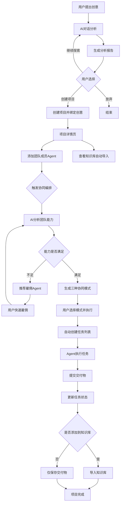

# ThinkCraft 业务流程审查报告

> 📅 生成时间：2026-01-14
> 🎯 目的：全面审查业务流程闭环，识别断层和设计缺陷

---

## 🔍 一、当前架构分析

### 1.1 核心数据实体

```javascript
// 项目数据结构（来自 app-main.js:4087）
{
  id: 'project_001',
  name: '智能健身APP项目',
  icon: '🚀',
  description: '项目描述',
  status: 'active',  // active | archived

  // 团队相关
  members: [],           // 人类成员（当前未使用）
  assignedAgents: [],    // 分配的数字员工ID

  // 内容相关
  linkedIdeas: [],       // 关联的创意ID（来自对话历史）⚠️
  ideas: [],             // 项目内的创意列表 ⚠️
  tasks: [],             // 任务列表 ⚠️
  files: [],             // 文件列表 ⚠️
  collaborations: [],    // 协同编排记录 ✅ 新增

  // 元数据
  createdAt: '...',
  updatedAt: '...'
}
```

---

## 🚨 二、核心问题诊断

### 2.1 创意管理混乱

**问题描述**：
- ❌ `linkedIdeas` 和 `ideas` 两个字段共存，职责不清
- ❌ 没有明确的创意添加/移除/编辑流程
- ❌ 创意来源不清晰（对话生成 vs 手动添加）
- ❌ 没有创意详情页面和管理界面

**当前逻辑推测**：
```
linkedIdeas: 从对话历史中提取的创意ID（引用）
ideas: 项目内直接创建的创意对象（副本）
```

**建议方案**：

#### 选项A：单一创意模式（推荐简单MVP）
```javascript
{
  primaryIdea: 'idea_001',     // 主创意ID（来自对话历史）
  ideaSnapshot: {              // 创意快照（防止源删除）
    title: '...',
    summary: '...',
    analysisResult: {...}
  },
  derivedIdeas: []             // 衍生创意列表（扩展方向）
}
```

**优势**：
- ✅ 逻辑清晰：一个项目聚焦一个核心创意
- ✅ 数据一致：创意源头唯一（对话历史）
- ✅ 易于追溯：从创意 → 项目 → 执行的路径明确

**实现逻辑**：
1. 用户完成创意对话分析后，可以「创建项目」
2. 创建项目时自动绑定当前对话的创意
3. 如果用户想添加新创意，需要：
   - 选择「开始新的创意分析」→ 完成后创建新项目
   - 或者将新创意作为「衍生创意」附加到当前项目

---

#### 选项B：多创意集合模式（适合复杂场景）
```javascript
{
  ideas: [
    {
      id: 'idea_001',
      sourceType: 'conversation',  // conversation | manual
      sourceId: 'chat_123',        // 对话ID
      title: '...',
      status: 'primary',           // primary | derived | archived
      addedAt: '...',
      snapshot: {...}
    }
  ]
}
```

**优势**：
- ✅ 灵活性高：支持多个创意并行
- ✅ 适合探索：可以测试不同方向

**劣势**：
- ⚠️ 复杂度高：需要创意切换、优先级管理
- ⚠️ 关注分散：容易失去主线

---

### 2.2 任务系统缺失

**问题描述**：
- ❌ `tasks: []` 字段存在，但**没有任何任务创建逻辑**
- ❌ 协同编排生成工作流后，没有转化为任务
- ❌ Agent分配任务后，无法查看任务列表和进度
- ❌ 任务统计卡片显示什么？数据从哪里来？

**当前断层**：
```
协同编排 → 生成工作流（workflow.steps）
                ↓
            【断层】没有保存到任务系统
                ↓
        tasks: [] 始终为空
```

**建议方案**：

#### 任务数据结构
```javascript
// Task 实体
{
  id: 'task_001',
  projectId: 'project_001',

  // 任务信息
  title: '设计用户登录界面',
  description: '包括账号密码登录、第三方登录',
  type: 'design',  // design | dev | test | review
  priority: 'high', // low | medium | high | urgent
  status: 'in_progress', // pending | in_progress | completed | blocked

  // 分配信息
  assignedTo: 'agent_ui_001',  // Agent ID
  assignedBy: 'collaboration_plan_001', // 来源

  // 依赖关系
  dependencies: ['task_002'],  // 依赖的任务ID
  blockedBy: [],               // 阻塞原因

  // 交付物
  deliverables: [
    {
      type: 'figma_file',
      url: '...',
      uploadedAt: '...'
    }
  ],

  // 元数据
  createdAt: '...',
  startedAt: '...',
  completedAt: '...',
  estimatedDuration: 3600,  // 秒
  actualDuration: null
}
```

#### 任务产生路径

**路径1：协同编排自动生成**
```
用户触发协同编排
  → AI生成工作流（步骤列表）
  → 用户确认执行
  → 系统自动创建任务列表
  → 分配给对应Agent
```

**实现伪代码**：
```javascript
// CollaborationModal.handleExecute()
async handleExecute() {
  const modes = this.state.getModes();
  const workflow = modes.workflowOrchestration;

  // 1. 创建任务列表
  const tasks = workflow.steps.map((step, index) => {
    return {
      id: `task_${Date.now()}_${index}`,
      projectId: this.state.getProjectId(),
      title: step.task,
      description: step.task,
      assignedTo: step.agentId,  // 需要工作流包含agentId
      status: 'pending',
      order: index,
      dependencies: step.dependencies,
      estimatedDuration: step.estimatedDuration,
      createdAt: new Date().toISOString()
    };
  });

  // 2. 保存到项目
  const project = getProjectById(projectId);
  project.tasks.push(...tasks);
  saveProject(project);

  // 3. 执行协同（原有逻辑）
  const result = await this.apiClient.executeCollaborationPlan(...);

  // 4. 更新任务状态
  tasks.forEach(task => {
    task.status = 'completed';
    task.completedAt = new Date().toISOString();
  });
}
```

**路径2：手动创建任务**
```
用户在项目详情页 → 点击「新建任务」 → 填写表单 → 分配Agent
```

**路径3：Agent主动申请任务**
```
Agent空闲时 → 查看项目待办任务 → 申请认领
```

---

### 2.3 交付物管理缺失

**问题描述**：
- ❌ 任务完成后，交付物存储在哪里？
- ❌ 如何查看每个任务的输出？
- ❌ 协同编排的结果如何结构化存储？

**当前状态**：
```javascript
// CollaborationModal.saveResultToProject() (line 674)
project.collaborations.push({
  planId: '...',
  task: '智能协同任务',
  timestamp: '...',
  teamMembers: [...],
  result: result?.summary || '执行完成',  // ⚠️ 仅保存文本摘要
  workflow: modes?.workflowOrchestration
});
```

**问题**：
- ⚠️ 只保存了文本摘要，没有结构化数据
- ⚠️ 没有分步骤的交付物
- ⚠️ 无法查看中间产物

**建议方案**：

#### 交付物数据结构
```javascript
// Deliverable 实体
{
  id: 'deliv_001',
  taskId: 'task_001',
  projectId: 'project_001',

  // 交付物信息
  type: 'document',  // document | code | design | analysis
  title: 'PRD文档 v1.0',
  format: 'markdown', // markdown | json | pdf | url

  // 内容存储
  content: '...',     // 文本内容（markdown、JSON等）
  fileUrl: '...',     // 文件URL（如果是文件）
  metadata: {         // 额外信息
    wordCount: 5000,
    version: '1.0',
    sections: ['需求', '用例', '验收标准']
  },

  // 审核状态
  reviewStatus: 'pending',  // pending | approved | rejected
  reviewComments: [],

  // 元数据
  createdBy: 'agent_pm_001',
  createdAt: '...',
  updatedAt: '...'
}
```

#### 交付物展示界面
```
项目详情页 → 「交付物」Tab
  ├─ 按类型筛选：文档 | 代码 | 设计 | 分析报告
  ├─ 按任务分组
  └─ 卡片展示
       ├─ 预览（markdown渲染 | PDF预览）
       ├─ 下载/复制
       └─ 审核按钮
```

---

### 2.4 知识库集成缺失

**问题描述**：
- ❌ 创意对话中的问题和分析结果没有沉淀
- ❌ 项目知识库功能存在，但没有自动导入机制
- ❌ Agent执行任务产生的知识无法复用

**建议方案**：

#### 知识库实体
```javascript
// KnowledgeItem 实体
{
  id: 'knowledge_001',
  projectId: 'project_001',

  // 来源追溯
  sourceType: 'conversation',  // conversation | task | collaboration | manual
  sourceId: 'chat_123',        // 对应的源ID

  // 内容
  type: 'qa',  // qa | document | insight | decision
  title: '目标用户画像分析',
  content: '...',
  tags: ['用户研究', '产品定位'],

  // 关联
  relatedIdeas: ['idea_001'],
  relatedTasks: ['task_005'],

  // 元数据
  importance: 'high',  // low | medium | high
  createdAt: '...',
  createdBy: 'ai' | 'user' | 'agent_pm_001'
}
```

#### 自动导入流程

**触发点1：创意对话完成**
```
对话生成报告
  → 提取关键问题和回答（userData.keyQuestions）
  → 转换为知识条目
  → 关联到创意ID
  → 用户创建项目时，自动导入项目知识库
```

**触发点2：任务完成**
```
Agent完成任务
  → 提交交付物
  → 系统提示：「是否将此交付物添加到知识库？」
  → 用户确认后添加，并打上标签
```

**触发点3：协同编排生成方案**
```
AI生成工作流、任务分解
  → 自动提取为「决策记录」
  → 保存到知识库（类型：decision）
```

#### 知识库查看界面
```
项目详情页 → 「知识库」Tab
  ├─ 搜索框（全文搜索）
  ├─ 标签云
  ├─ 按类型筛选
  └─ 卡片列表
       ├─ 标题
       ├─ 摘要
       ├─ 来源标签（从对话导入 | 任务产出）
       └─ 相关链接（点击跳转到源对话/任务）
```

---

## 📊 三、完整业务流程设计

### 3.1 主流程：从创意到项目到执行



### 3.2 关键决策点

#### 决策1：项目与创意的关系

**推荐：一对一关系（MVP阶段）**
- ✅ 一个项目绑定一个主创意
- ✅ 支持衍生创意作为子方向
- ✅ 如果要探索新创意，开始新对话→创建新项目

**实现要点**：
```javascript
// 创建项目时
function createProjectFromIdea(conversationId) {
  const conversation = getConversation(conversationId);
  const idea = extractIdeaFromConversation(conversation);

  const project = {
    id: generateId(),
    name: idea.title || '新项目',
    primaryIdea: {
      id: conversationId,
      title: idea.title,
      summary: idea.summary,
      analysisResult: conversation.userData,
      snapshotAt: new Date().toISOString()
    },
    derivedIdeas: [],
    // ...其他字段
  };

  // 自动导入知识库
  importKnowledgeFromConversation(project.id, conversation);

  return project;
}
```

#### 决策2：任务的产生方式

**推荐：协同编排为主 + 手动创建为辅**
1. **协同编排自动生成**（80%）
   - 用户触发智能协同
   - AI生成工作流
   - 系统自动转化为任务列表

2. **手动创建任务**（20%）
   - 项目详情页「新建任务」按钮
   - 填写表单（标题、描述、分配给谁）
   - 适用于临时任务和补充任务

#### 决策3：交付物的查看方式

**推荐：任务详情 + 独立Tab**
1. **任务详情页**：
   - 点击任务卡片 → 打开详情抽屉
   - 显示：任务信息 + 交付物列表 + 状态时间线

2. **项目交付物Tab**：
   - 汇总所有任务的交付物
   - 按类型/时间筛选
   - 提供预览和下载

---

## 🛠️ 四、实施计划

### 阶段1：修复当前问题（紧急）✅ 优先
- [x] 修复userId不一致问题
- [x] 修复state未暴露导致雇佣报错
- [ ] 修复后端数据持久化（使用SQLite或JSON文件）
- [ ] 清理冗余文档和代码

### 阶段2：完善任务系统（核心）
- [ ] 协同编排结果自动转化为任务
- [ ] 任务列表展示界面
- [ ] 任务详情页（含交付物）
- [ ] Agent任务执行状态同步

### 阶段3：交付物管理（重要）
- [ ] 交付物数据结构设计
- [ ] 交付物提交界面
- [ ] 交付物预览和下载
- [ ] 项目交付物汇总页面

### 阶段4：知识库集成（增强）
- [ ] 对话知识自动提取
- [ ] 创建项目时自动导入
- [ ] 任务完成时提示添加知识
- [ ] 知识库搜索和筛选界面

---

## 📝 五、代码清理建议

### 5.1 冗余文档清理

**已删除（待提交）**：
- ✅ FULL-REFACTORING-SUMMARY.md
- ✅ MVP.md
- ✅ PHASE1-COMPLETION-REPORT.md
- ✅ PHASE1-FINAL-REPORT.md
- ✅ PHASE2-COMPLETION-REPORT.md
- ✅ PROJECT-GOVERNANCE-SUMMARY.md
- ✅ REFACTORING-GUIDE-PHASE1.md
- ✅ REFACTORING-GUIDE-PHASE2.md

**保留**：
- ✅ docs/【0】思考起点.md（核心理念）
- ✅ docs/README.md（项目文档入口）
- ✅ docs/DDD-REFACTORING-PLAN.md（架构参考）

**建议新增**：
- 📄 docs/BUSINESS-FLOW.md（本文档）
- 📄 docs/API.md（API文档）
- 📄 docs/DATABASE-SCHEMA.md（数据模型）

### 5.2 代码结构优化

**当前问题**：
- app-main.js 过大（3700+行）
- 混合了多个领域逻辑（对话、项目、Agent、协同）

**建议拆分**：
```
frontend/js/
├── core/
│   ├── api-client.js ✅
│   └── router.js ❌ 缺失（路由管理）
├── infrastructure/
│   ├── UserIdManager.js ✅
│   ├── state/ ✅
│   └── storage/ ✅
├── modules/
│   ├── conversation/ ❌ 拆分（对话系统）
│   ├── project/ ❌ 拆分（项目管理）
│   ├── agent/ ❌ 拆分（Agent管理）
│   ├── collaboration/ ✅ 已有
│   └── knowledge/ ❌ 缺失（知识库）
└── components/
    ├── collaboration-modal.js ✅
    ├── project-detail.js ❌ 缺失
    ├── task-list.js ❌ 缺失
    └── knowledge-panel.js ❌ 缺失
```

---

## 🎯 六、总结

### 当前系统成熟度评估
| 模块 | 完成度 | 评分 | 说明 |
|------|--------|------|------|
| 对话分析 | 90% | ⭐⭐⭐⭐⭐ | 核心功能完善 |
| 报告生成 | 85% | ⭐⭐⭐⭐ | 格式完整但缺少结构化 |
| Agent雇佣 | 70% | ⭐⭐⭐ | 基础功能可用，数据持久化缺失 |
| 协同编排 | 60% | ⭐⭐⭐ | AI生成流程完善，但执行断层 |
| 项目管理 | 40% | ⭐⭐ | 数据结构存在但功能不完整 |
| 任务系统 | 10% | ⭐ | 仅有数据结构，无实际功能 |
| 交付物管理 | 5% | - | 基本缺失 |
| 知识库 | 20% | ⭐ | 界面存在但无自动化流程 |

### 核心问题优先级
1. 🔥 **P0（致命）**：userId不一致 + 数据持久化
2. 🔥 **P1（高优）**：任务系统缺失
3. ⚠️ **P2（中优）**：交付物管理
4. ✨ **P3（增强）**：知识库集成

---

**结论**：ThinkCraft具备优秀的创意分析能力，但从创意到执行的完整闭环尚未打通。当务之急是完善任务系统，将协同编排的产出落地到可追踪的任务和交付物上。
