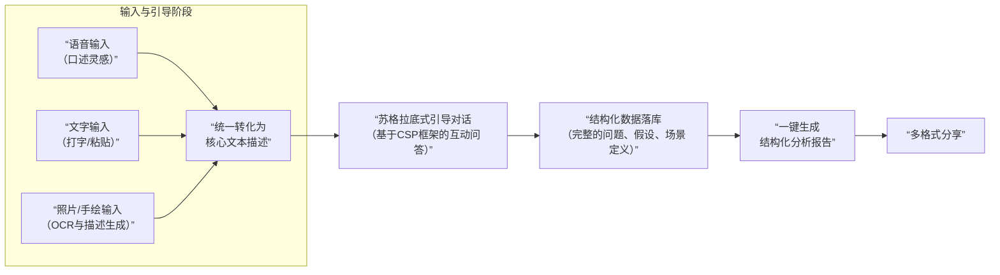

# **ThinkCraft MVP：功能边界与核心体验定义**

基于“个人AI思维助手”的定位，MVP的核心任务是**验证一个关键假设**：用户是否会为“将模糊想法快速转化为结构化洞察”这一核心价值买单。所有功能设计必须围绕此目标，保持极致的专注。

## **一、 MVP的明确功能边界**

**做什么（核心闭环）**：

1.  **想法的快速捕获**（降低输入门槛）。
2.  **想法的深度结构化**（通过交互提升质量）。
3.  **专业分析报告的生成与分享**（交付明确价值）。

**不做什么（划清边界）**：

1.  **不构建社区**：无关注、点赞、公开时间线。
2.  **不进行多智能体复杂协作**：MVP使用单一、精心调校的模型完成分析。
3.  **不生成可运行的原型或代码**：这是明确的未来功能，不属于MVP范畴。
4.  **不提供复杂的项目管理工具**：想法管理仅限于基础的列表、标签和搜索。

## **二、 “快速获取能力”的具象化设计**

快速获取的核心是 **“在任何思维状态下，3秒内开始记录”** 。

| 场景               | 实现方式                                                   | 关键体验              |
| :----------------- | :--------------------------------------------------------- | :-------------------- |
| **应用内记录**     | 主屏即输入框，打开即录。                                   | 零层级交互。          |
| **系统级快速入口** | iOS/Android小组件，提供语音、文字快速输入。                | 不解锁手机，1步完成。 |
| **外部内容捕获**   | 系统分享菜单集成。浏览网页、文档时，一键分享至ThinkCraft。 | 无缝衔接灵感来源。    |
| **离线与延迟处理** | 无网络时本地保存，联网后自动同步分析。                     | 无感知，确保流畅。    |

## **三、 多模态输入与智能引导的深度融合**

支持多模态不仅是为了方便，更是为了**捕捉想法最原始、最丰富的状态**，并通过AI将其转化为可分析的文本。

**1. 多模态输入的具体实现：**

- **语音**：实时转写，并保留录音原件以备复查。
- **文字**：支持纯文本及Markdown简化标记（如`## 标题`）。
- **照片/手绘**：
  - **OCR**：提取图片中的文字。
  - **图像描述**：通过多模态模型，用文字描述图片中的场景、图表或草图内容。
  - **混合输出**：将提取的文字与生成的描述结合，形成初步想法描述，供用户确认和修改。

**2. “苏格拉底式提问”的交互设计：**

- **触发时机**：用户完成初始输入（任一模态）后，系统自动进入引导模式。
- **问题逻辑**：基于 **“创意结构化协议”** 的简化版（MVP版），围绕4个核心元问题展开：
  1.  **对象**：你在为谁解决问题？（定义目标用户）
  2.  **问题**：你解决的核心痛点是什么？（定义问题本质）
  3.  **方案**：你的解决方案是什么，为何独特？（定义价值主张）
  4.  **验证**：如何知道这个想法成功了？（定义早期关键指标）
- **交互形式**：仿聊天界面，AI一次提一个问题，用户可语音或文字回答。用户可随时跳过或返回修改之前答案。整个过程应像与一个富有同理心、专注的教练对话。

## **四、 结构化报告：方法论与可交付物**

报告是价值交付的终点，必须体现专业性。

- **核心方法论**：采用 **“精益画布”** 作为MVP的报告框架。它比SWOT更具行动导向，比商业计划书更轻量，完美契合早期创意验证。
- **报告内容**：自动填充用户在引导对话中提供的信息，并由AI补充以下分析维度：
  - **问题验证**：该问题是否真实、普遍、紧迫？
  - **解决方案适配度**：方案是否直击要害？
  - **独特优势**：潜在的壁垒或差异点是什么？
  - **可行性初判**：技术、市场、运营层面的简易风险评估。
  - **下一步行动**：给出3-5条具体的验证建议（如“访谈10位目标用户”）。
- **可视化呈现**：报告以信息图形式呈现，核心部分（如精益画布）可生成图片。

## **五、 分享与传播设计**

分享是实现产品增长和用户价值延伸的关键。

- **分享对象**：合作伙伴、导师、潜在团队成员、社交媒体关注者。
- **分享格式**：
  1.  **高精度图片**：适用于微信、Twitter等社交平台。
  2.  **交互式链接**：收件人可打开一个专属网页，查看报告，甚至与简化版的AI就报告内容进行Q&A（无需登录）。
  3.  **Markdown/PDF**：用于归档或导入其他生产力工具。
- **分享文案**：自动生成一段引人入胜的文案，例如：“我用ThinkCraft深度分析了我的创业想法‘XXX’，这是一份AI生成的分析报告，欢迎给我提意见！”

## **六、 附加必要功能与考量**

1.  **想法管理**：主页为想法卡片流，可按状态（待分析、已分析）、标签筛选。
2.  **用户反馈回路**：在报告页提供“报告质量评分”（1-5星）和“反馈输入框”。这是**训练未来专属模型**最宝贵的早期数据源。
3.  **隐私与数据安全**：明确告知用户数据用于改进服务，并提供“不用于训练”的选项（尽管会削弱长期优势）。初期必须建立绝对信任。
4.  **技术栈考量**：
    - **前端**：React Native（兼顾iOS/Android与未来Web）。
    - **AI集成**：使用OpenAI GPT-4或Claude 3等领先模型进行深度分析；使用 Whisper（语音）、GPT-4V（多模态）处理输入。
    - **成本控制**：对用户输入和对话进行优化，压缩Token使用，设置合理的免费额度。

## **七、 MVP成功的关键验证指标**

1.  **用户留存**：周留存率（特别是第2周、第4周）是否健康？这验证产品是否被持续需要。
2.  **分享率**：有多少用户生成了报告并选择分享？这验证报告的实际价值。
3.  **对话完成率**：有多少用户完成了完整的苏格拉底式引导对话？这验证交互模式的有效性。
4.  **自然增长**：通过分享链接带来的新用户注册数。这验证产品的自传播潜力。

**总结**：ThinkCraft的MVP是一个**精心设计的“想法压力测试舱”**。它通过极低的输入门槛吸引用户进入，通过有温度的对话提升想法质量，最终交付一份具有专业外观的报告，使用户的创意获得第一次严肃对待。这个过程本身，就是“认知平权”最有力的体现。
