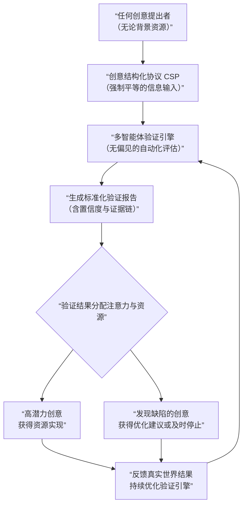

# **ThinkCraft：认知平权时代的创意验证协议**

## **1. 摘要：重新定义创意价值的公平起点**

**ThinkCraft** 是一个基于**结构化创意协议**与**多智能体验证引擎**的认知平权基础设施。我们相信，创意的初始价值评估不应被其拥有者的资源、背景或地理位置所扭曲。我们的使命是建立一套机器可执行的“创意质量评估标准”，让每一个想法都能基于其内在潜力，获得公平的审视、验证和实现机会。

**核心命题**：在一个信息过载但注意力稀缺的时代，最大的不平等是“认知关注的不平等”。ThinkCraft通过将顶级投资机构、产品团队和技术专家的集体智慧编码成可大规模复用的AI智能体工作流，为任何创造者提供原本只有少数人能享有的专业验证服务。

**市场本质**：我们进入的是“**创意验证权**”市场——一个因AI技术成熟而刚刚打开的千亿级市场。我们不仅出售工具，更出售一种新的可能性：让验证想法的边际成本趋近于零。

**财务前景**：通过“协议使用费+智能体服务费+生态匹配佣金”的混合模式，在三年内实现千万美元级营收，五年内成为早期创意发现领域的基础设施。

**融资需求**：300万美元种子轮，用于完成核心协议定义、启动数据飞轮并验证首个产品市场契合点。

---

## **2. 问题重构：认知不平等的三个断层**

当前创意实现路径中存在三重结构性不平等：

**2.1 验证标准的不透明性**
- 顶级风投凭借“模式识别”评估项目，但这种直觉是数十年经验和特权网络的结果，不可复制。
- 普通创造者缺乏清晰的自我评估框架，陷入“我不知道自己不知道什么”的困境。

**2.2 验证资源的不对称性**
- 精英创业者能轻松获取法律、技术、市场方面的专家咨询，而独立创造者只能依赖有限的个人知识和网络。
- 外包市场信息不对称，验证成本从数千到数十万美元不等，且质量参差不齐。

**2.3 注意力的马太效应**
- 平台算法倾向于放大已有声誉者的声音，新人想法难以获得初始关注。
- 社交资本（学历、职业背景、人脉）成为想法获得关注的隐形门票，而非想法本身的质量。

**根本矛盾**：**创意的大众化生产**与**验证的精英化服务**之间的矛盾。AI生成内容加剧了前者，但未解决后者。

---

## **3. 解决方案：构建创意验证的“公平衡量衡”**

我们的解决方案不是另一个“更好的分析工具”，而是一套完整的**验证操作系统**，它包含三个相互关联的层次：

### **3.1 协议层：创意结构化描述语言**
- **CSP（创意结构化协议）**：强制任何创意在输入时必须回答六个核心问题：
  1. 你为谁解决什么问题？（用户与痛点）
  2. 为什么现在是解决的时候？（时机判断）
  3. 你的解决方案为什么独特？（差异化假设）
  4. 你将如何知道成功？（可测量指标）
  5. 实现它最大的障碍是什么？（关键风险）
  6. 你需要什么资源才能开始？（初始需求）
- **价值**：这不仅是数据格式，更是**思维框架**。它降低了结构化思考的门槛，同时为机器评估提供了统一输入。

### **3.2 引擎层：可验证的智能体协作网络**
- **验证不是单一动作，而是一个可重复、可审计的过程链**：
  1. **解析引擎**：将CSP输入拆解为可验证的假设集合。
  2. **智能体分工网络**：专用智能体对每个假设进行独立验证（市场存在、技术可行性、需求强度等）。
  3. **置信度聚合**：每个验证结果附带置信度评分和证据来源。
  4. **沙盒执行环境**：对于产品类创意，自动生成最小可行原型并在隔离环境中测试核心流程。
- **关键创新**：验证过程的**透明性**与**可重复性**。用户可以追溯每个结论的证据链，这与人类专家的“黑箱判断”形成根本区别。

### **3.3 网络层：基于验证信誉的注意力分配**
- **VRS（验证信誉系统）**：每个创意获得一个基于验证过程的**综合评分**，而非社交点赞数。
- **注意力市场**：投资者、合作者可以按验证评分、风险类别等维度筛选项目，系统根据匹配度推送。
- **贡献者网络**：开发者、设计师基于其完成验证任务的历史准确率建立专业信誉，而非个人品牌。

---

## **4. 差异化深度：为什么这不是“又一个AI笔记工具”**

与Notion/Miro+AI或其他生产力工具的根本区别：

| 维度 | ThinkCraft | 生产力工具+AI | 结果差异 |
|------|------------|----------------|-----------|
| **核心价值** | **产生确定性**（这是否是个好主意？） | **增强表达**（如何更好地呈现想法？） | 我们解决决策问题，它们解决表达问题 |
| **数据逻辑** | **封闭结构，开放输出**：输入必须结构化，输出是标准化验证报告 | **开放结构，开放输出**：自由格式输入，自由格式输出 | 我们的结构化允许深度计算，它们的灵活性适合创意发散 |
| **工作模式** | **主动验证**：系统根据协议主动发起调查、测试和分析 | **被动响应**：AI响应用户指令，帮助写作、总结 | 我们是“主动的顾问”，它们是“被动的助手” |
| **网络效应** | **验证信誉网络**：用户因验证质量而来，形成专业信任网络 | **社交协作网络**：用户因协作关系而来 | 我们的网络具有抗社交资本稀释的特性，更关注客观质量 |

**更深层的防御**：
1. **验证准确性的飞轮效应**：使用越多，验证引擎越准确，用户越依赖。
2. **协议成为事实标准**：如果CSP成为早期项目提交的默认格式，我们将成为创意漏斗的入口。
3. **生态的金融属性**：当验证结果直接关联资源分配时，生态具有更强的粘性和价值捕获能力。

---

## **5. 商业模式：为“认知平权”定价**

我们的收费不是为功能，而是为**降低不确定性**这一核心价值。

**5.1 个人创造者阶梯**
- **免费层**：基础CSP框架+简要分析（评估想法的完整性）。
- **探索者（$19/月）**：完整验证报告+基础原型生成（每月3次）。
- **建造者（$99/月）**：无限验证+高级原型功能+资源匹配权限。

**5.2 企业级服务**
- **团队验证工作区**：企业创新团队使用，管理内部创意管道。
- **API服务**：允许其他平台（如众筹网站、孵化器）调用我们的验证引擎。
- **白标解决方案**：为投资机构提供定制化的项目筛选系统。

**5.3 生态交易费**
- 当基于平台验证结果的成功匹配（融资、团队组建）发生时，收取2-4%的成功费。

**关键洞察**：我们本质上是在**证券化创意验证过程**。个人用户支付少量费用获得“评估报告”，专业用户为高质量项目流支付更高费用。

---

## **6. 市场进入策略：从“不平等”最明显的场景切入**

**6.1 第一阶段：服务“被忽略的创造者”**
- 目标用户：**非硅谷、非一线城市、无顶尖背景**的技术人才和创业者。
- 渠道：全球性的远程工作社区、新兴市场创业论坛、技术教育平台。
- 信息：突出“你的第一个AI联合创始人”这一概念。

**6.2 第二阶段：建立行业标准**
- 与早期投资机构合作，将其投资逻辑编码为专用验证智能体。
- 开源CSP核心规范，鼓励工具集成，成为事实标准。
- 发布“年度创意验证趋势报告”，建立思想领导力。

**6.3 第三阶段：重构注意力经济**
- 推出基于验证评分的“创意发现”平台，挑战传统社交驱动的产品发现网站。
- 建立“验证即服务”联盟，与大学、研究机构、企业研发部门合作。

---

## **7. 团队要求：非传统的组合**

我们需要的不是典型的“AI创业团队”，而是：
- **认知科学家**：理解人类如何形成和评估创意。
- **机制设计师**：能设计激励兼容的验证系统和信誉机制。
- **AI伦理专家**：确保验证过程无偏见，符合平权价值观。
- **开源倡导者**：能以开放但可持续的方式推动协议采用。

---

## **8. 财务预测：认知平权的经济学**

| 阶段 | 核心指标 | 收入驱动 | 社会影响力 |
|------|----------|----------|------------|
| **第1年** | 10万CSP提交量 | 订阅收入为主 | 证明结构化验证可行 |
| **第2年** | 100万次验证执行 | API收入增长 | 帮助1000+个项目获得传统渠道难以获得的关注 |
| **第3年** | 平台促成$1亿资源匹配 | 交易佣金成为重要来源 | 验证标准开始影响早期投资决策模式 |
| **第5年** | 成为千万级创造者的默认验证工具 | 多元收入均衡 | 系统性降低早期创业的地理和背景歧视 |

---

## **9. 风险与哲学挑战**

**9.1 过度结构化的风险**
- 可能抑制非常规的、突破性创意。
- **缓解**：CSP保持演进，允许“自由格式”补充，并通过智能体识别非常规价值。

**9.2 算法偏见风险**
- 训练数据中的偏见可能被编码进验证标准。
- **缓解**：多样化训练数据，透明化验证逻辑，引入多方审计。

**9.3 人性的抵抗**
- 人们可能更愿意相信人类专家的“直觉”而非机器验证。
- **缓解**：不取代人类，而是提供“第二意见”，用事实证明机器验证在某些维度的优越性（如一致性、全面性）。

---

## **10. 长期愿景：从平权工具到认知基础设施**

ThinkCraft的终极状态不是一家公司，而是一个**公益性与商业性结合的新型机构**：

1. **创意验证基金会**：管理开源协议，确保其公平演进。
2. **验证引擎公司**：提供高性能的商业化验证服务。
3. **注意力分配市场**：基于验证结果高效匹配资源。

**我们最终衡量的成功**：不是平台上有多少独角兽诞生，而是有多少**原本会被忽视的好想法**因为我们的存在而被看见、被验证、被实现。

**认知平权的真正含义**：不是让每个想法都成功，而是让每个想法都获得与其内在质量相匹配的、公平的验证机会。

---

## **11. 结语：一场关于创意民主化的实验**

ThinkCraft始于一个简单的观察：人类历史上大多数突破性创意最初都被低估，因为它们来自“错误”的人或地方。AI赋予我们一个历史性的机会来纠正这种系统性偏差。

我们邀请您投资的不仅是一家公司，更是一个实验：**如果我们能移除创意验证阶段的人为偏见和不平等，人类的创新速度会加快多少？**

种子轮300万美元将主要用于：
1. 构建最小可行的验证引擎（证明机器验证能达到专业人类80%的水平）。
2. 启动首个“平权实验”，资助1000个来自资源匮乏地区的创意进行深度验证。
3. 组建一个真正多元化的创始团队，确保我们自身就是认知平权的实践者。

让我们一起，为下一个爱因斯坦——无论他今天身在何处——提供被世界看见的公平机会。