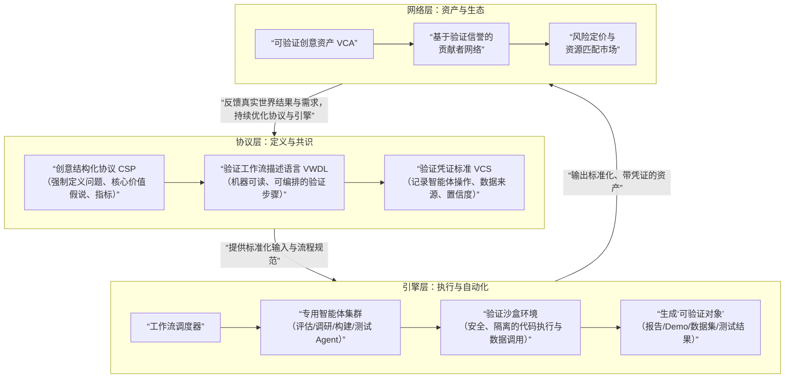

# **ThinkCraft：创意验证操作系统 商业计划书**

## **摘要：重构创意验证的底层逻辑**

**ThinkCraft** 并非另一个附着于大模型的“智能笔记”或“协作白板”。我们致力于构建一个**基于“结构化创意数据”与“自主智能体工作流”的新一代协议**，旨在系统性解决人类创意从涌现到验证过程中的根本性低效问题。

**核心颠覆**：传统流程中，创意以自由格式（文本、草图）存在，验证依赖昂贵的人力循环（讨论、调研、外包）。ThinkCraft通过定义一种机器可读的 **“创意中间件”** ，将验证过程转化为可自动化、可计算、可规模化的标准化流程。

**市场本质**：我们切入的是万亿美元规模的“**早期创新风险缓释**”市场，为个体创业者、企业创新部门及投资机构，提供决策前的“数字压力测试”服务。

**财务愿景**：五年内，通过提供从“个人验证引擎”到“生态级协议”的递进服务，实现年营收数亿美元，并主导创意验证数据的标准定义。

**融资需求**：首轮300万美元，用于完成协议定义、核心引擎研发及启动初始数据飞轮。

---

## **1. 问题洞察：创意验证的“范式困境”**

当前创意实现路径存在结构性缺陷，这远非“缺乏一个更好的协作工具”那么简单。

**1.1 核心矛盾：非结构化创意与结构化验证的鸿沟**
创意以感性、模糊、非结构化的形式（一句话、一张草图）诞生，但其验证需要理性、清晰、结构化的信息（市场规模、技术路径、成本）。二者之间的翻译与填充，完全依赖创造者个人的经验与资源，这是最大的瓶颈与不确定性来源。

**1.2 现有方案的“天花板”**

- **生产力工具（Notion, Miro）**：精于承载和协作，但**不负责验证**。其AI化演进本质是“内容生成助手”，无法解决从模糊到确定的核心矛盾。
- **通用大模型（ChatGPT, Claude）**：是卓越的“即时脑暴伙伴”，但受限于“一次对话”的语境，无法维持一个持续演进、可累积知识的“验证项目”。其输出是建议，而非可执行的资产。
- **外包与咨询**：高质量但成本高昂、无法规模化和即时响应，扼杀了大量轻量级创意的验证可能。

**结论**：市场缺少一个**原生为“验证”而设计，能将非结构化输入自动转化为结构化验证过程与资产**的系统。

---

## **2. 解决方案：ThinkCraft协议与三层架构**

我们的解决方案是构建一个 **“验证即服务”** 的封闭操作系统。其核心是引入一层**创意描述与验证的中间件**。

### **2.1 哲学：从“文档中心”到“验证工作流中心”**

ThinkCraft不生产文档，它生产**验证工作流及其可信结果**。用户提交一个创意，实质是提交一个验证工单，系统则交付一份附有证据链的验证报告或可交互原型。

### **2.2 核心三层架构**

**第一层：协议层（根本性差异化）**

- **创意结构化协议**：强制用户在输入阶段将模糊想法转化为结构化数据对象。这定义了系统的“原生资产”，是后续一切自动化的基石。
- **验证工作流描述语言**：将“分析一个电商创意”此类任务，拆解为可被智能体执行的标准化步骤序列。
- **价值**：**建立事实标准**。一旦生态形成，后续所有工具和参与者都需遵循此协议，形成最高壁垒。

**第二层：引擎层（复杂性壁垒）**

- 一个调度、管理和执行**专用验证智能体**的分布式系统。它不是调用单一模型，而是像工厂流水线一样，让多个“专业机器人”协作完成从市场分析到原型构建的全链条任务。
- **验证沙盒**：提供安全环境运行生成的代码、调用API获取实时数据，确保验证过程的可重复与可信。

**第三层：网络层（生态效应）**

- **可验证创意资产**：是带有完整验证凭证（如“技术可行性由X智能体于X时间评估，置信度85%”）的标准化项目包，可直接用于融资或组队。
- **基于验证的信誉系统**：贡献者（开发者、设计师）的信誉基于其完成验证任务的历史准确率，而非社交人气。
- **风险定价市场**：投资人可依据系统提供的标准化验证报告，进行更高效、数据驱动的早期风险定价。

---

## **3. 竞争与壁垒：系统性防御**

与“生产力工具+AI”的竞争是表象。本质是**标准化验证系统**与**非标准化内容工具**的竞争。

| 维度           | **ThinkCraft (验证操作系统)**                              | **“Notion/Miro + AI” (智能内容工具)**        | **我们的防御策略**                                                                               |
| :------------- | :--------------------------------------------------------- | :------------------------------------------- | :----------------------------------------------------------------------------------------------- |
| **数据本质**   | **结构化、可计算、可执行的“验证对象”**                     | 非结构化或半结构化的**文档与白板**           | 我们从源头创造高维数据。对方要复制，需彻底改变产品哲学与存量用户习惯，成本极高。                 |
| **工作核心**   | **执行标准化验证流程**，输出确定性结论。                   | **辅助自由内容创作与整理**，输出是材料。     | 我们提供的是“结论即服务”，用户为降低不确定性付费。对方提供的是“材料生产力”，难以直接货币化验证。 |
| **系统复杂度** | **多智能体协作的复杂系统**，涉及调度、状态管理、质量控制。 | **内容生成与编辑的增强功能**，工程相对简单。 | 我们构建的是“发动机”，对方添加的是“电动助力”。复制整个发动机的研发周期和难度是数量级的差异。     |
| **生态网络**   | **基于验证凭证的信任网络**，连接创意、贡献者与资本。       | **基于社交与协作的关系网络**。               | 我们的网络具有金融属性和抗博弈性，直接关联价值交换，比社交网络更坚固、更垂直。                   |

**终极壁垒**：ThinkCraft的壁垒是**协议共识**、**验证引擎的工程复杂度**与**验证网络效应**的三位一体。任何一方想入场，必须同时攻克这三座大山。

---

## **4. 商业模式：为“确定性”分层定价**

我们的收入模型与产品架构层直接对应。

| 产品阶段                 | 核心价值主张                                                         | 收入模式                            | 目标客群与定价逻辑                                                                     |
| :----------------------- | :------------------------------------------------------------------- | :---------------------------------- | :------------------------------------------------------------------------------------- |
| **协议层** （个人版） | **个人创意验证引擎**：将你的想法转化为结构化验证项目与报告。         | SaaS订阅 （$29/月）              | **独立创造者、产品经理**：为“个人决策的确定性”支付基础费用。                           |
| **引擎层** （专业版） | **自动化原型工厂**：一键调度智能体工作流，生成可交互Demo与深度分析。 | 用量积分制 （如 $50/次深度构建） | **初创团队、小微企业**：将数周数万美元的外包成本，转化为几分钟、数百美元的标准化服务。 |
| **网络层** （平台）   | **生态级信任与匹配市场**：提供带验证凭证的优质项目流与贡献者网络。   | 交易佣金 （成功匹配收取3-5%）    | **投资者、服务商、招募方**：为经过预筛、高可信度的交易机会支付佣金。                   |

---

## **5. 市场与增长：从协议采用到生态繁荣**

**5.1 启动策略：协议先行，工具切入**

1.  **定义并开源**核心的 **“创意结构化协议”** 基础部分，吸引早期技术拥护者和研究者，建立思想领导力。
2.  **推出面向开发者的“验证引擎”API**，让开发者能利用我们的智能体为其社区或产品提供验证功能。**我们首先成为B2D公司**。
3.  **同步推出极简的个人工具**，展示协议与引擎的强大，从底部渗透创作者。

**5.2 增长引擎：双边网络冷启动**

- **供给侧**：通过“贡献者计划”吸引优秀开发者、设计师入驻，通过完成系统派发的验证任务赚取积分和建立信誉。
- **需求侧**：与早期孵化器、天使投资社区合作，为他们提供经过验证的项目流，成为其优质案源渠道。

**5.3 生态扩张**

- 推动协议成为细分领域（如Web3、AI应用）的**事实上的项目提交标准**。
- 许可企业客户在内部部署私有验证引擎，用于内部创新管理。

---

## **6. 团队要求：跨学科的核心能力**

团队必须是三位一体的结合：

- **系统架构师**：具备设计复杂状态机与分布式系统的能力，理解智能体协作的工程范式。
- **AI应用科学家**：不仅懂大模型，更擅长构建基于LLM的可靠、可评估的专用智能体。
- **协议产品经理**：具备抽象领域问题、设计规则系统和经济机制的能力，拥有开发者生态运营经验。

---

## **7. 财务预测与里程碑**

| 阶段/财年            | 核心目标                                                     | 关键成果指标                                    | 收入预期                  |
| :------------------- | :----------------------------------------------------------- | :---------------------------------------------- | :------------------------ |
| **Year 1: 协议奠基** | 完成CSP 1.0定义；验证引擎MVP上线；获取首批1000名开发者用户。 | 协议被3个外部项目采用；引擎API调用次数>10万次。 | $0.5M (主要为API调用收入) |
| **Year 2: 工具渗透** | 个人工具用户达10万；启动“贡献者网络”内测。                   | 月活创作者>5万；平台上活跃贡献者>500人。        | $5M (SaaS订阅为主)        |
| **Year 3: 生态启动** | 上线创意资产市场；与至少两家主流孵化器达成数据合作。         | 平台成功匹配项目>100个；产生佣金收入。          | $20M (SaaS与佣金并重)     |
| **Year 5: 平台成熟** | ThinkCraft协议成为早期科技项目验证的常用标准之一。           | 平台年验证项目数超百万；生态第三方工具出现。    | $100M+                    |

---

## **8. 风险与挑战：认知与执行的陡坡**

- **协议采纳风险**：市场可能拒绝新的结构化约束。**对策**：通过提供无与伦比的自动化价值（如“一键生成Demo”）来补偿用户的结构化输入成本，并持续优化协议的用户友好性。
- **技术实现风险**：多智能体系统的稳定性与输出质量是巨大挑战。**对策**：采用“**Human-in-the-Loop**”作为核心设计原则，关键验证环节引入人工审核或众包复核，确保系统初期可信度。
- **竞争狙击风险**：巨头可能利用其入口和用户优势推广类似框架。**对策**：保持极致的垂直深度与社区文化，并积极探索与巨头的合作（如成为其生态的“专业验证模块”），而非直接对抗。

---

## **9. 结论：不仅仅是一家公司，更是一种基础设施**

ThinkCraft的终极形态，是成为数字时代创意经济的**基础协议层**。我们不是在应用层与无数笔记和协作工具竞争，而是在定义创意如何被机器理解、评估和实现的新规则。

**我们出售的不是功能，而是“加速的确定性”。** 当创意实现的速度不再受限于人力与资本，而是受限于想象力本身时，我们便实现了真正的“认知平权”。

**种子轮300万美元的使用**：其中70%用于组建一个能攻克协议与引擎核心的微型特种团队（约8-10人），20%用于开发者生态的启动与运营，10%用于法律、知识产权及协议标准推广。我们的第一个里程碑，是交付一个能让开发者惊叹的“验证引擎”演示。
