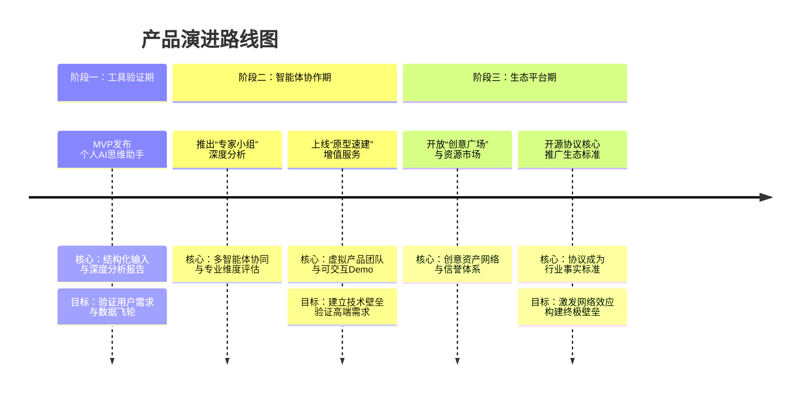

### **战略性创造性开发流程平台（SCDP）项目立项报告**

**核心摘要：**
本项目旨在构建一个面向未来、战略驱动的**战略性创造性开发流程平台**，以解决个人及组织在创意产生、评估与实现过程中的核心痛点。平台将深度融合 **“协议化创意验证”的开放性与“操作系统级验证服务”的深度闭环**，通过定义一套机器可理解的“创意结构化协议”，并构建一个多智能体（Agent）协同的“验证工作流引擎”，为从灵感到最小可行产品的全流程提供认知平权与专业级支持。我们不仅提供一款工具，更致力于成为智能时代创新协作的基础协议与核心平台。

---

### **一、 战略背景与机遇：从认知平权到价值实现**

#### **1. 组织与个人痛点：被淹没的创意与高企的验证成本**
*   **创意黑洞**：超过80%的灵感因缺乏即时、有效的结构化审视与记录而流失。
*   **验证鸿沟**：个体创作者与中小企业缺乏专业、低成本的商业与技术验证能力，从想法到原型的传统路径依赖昂贵的人力咨询或复杂的自我学习，成本（时间与金钱）极高，且质量不一。
*   **决策低效**：传统流程中，非结构化创意（文本、草图）与结构化验证需求（市场、技术、财务）之间存在巨大翻译成本，决策依赖直觉而非数据支撑。
*   **协作割裂**：创意产生、分析、原型构建、团队组建的流程散落在不同工具（笔记、AI聊天、设计软件、代码平台）中，无法形成可追溯、可复用的知识资产。

#### **2. 市场与技术趋势：AI从辅助工具到价值创造伙伴**
*   **Agentic AI的范式革命**：人工智能正从“辅助工具”向具备自主决策与执行能力的“价值创造者”跃迁。Gartner预测，到2028年，全球15%的日常工作决策将由AI代理完成。这为自动化、专业化的创意验证提供了技术基础。
*   **多智能体协同成为关键**：单一AI能力有限，未来属于能够分工协作、解决复杂问题的多智能体系统。这在技术上为模拟“虚拟产品团队”提供了可能。
*   **“数字同事”常态化**：82%的企业高层计划在未来12-18个月内将智能体作为“数字同事”纳入核心业务。市场对AI工作伙伴的接受度正在快速形成。
*   **应用生态向垂直与协同演进**：AI应用竞争已从通用模型转向深耕场景与生态协同。头部应用正向垂直领域渗透（如教育、健康），同时通过API与插件构建生态。定义一个垂直领域的核心工作流标准，是构建生态的起点。

#### **3. 我们的机遇：定义创意验证的新范式**
在上述趋势交汇点，存在一个历史性机遇：**构建一个以“结构化创意协议”为基石、以“多智能体验证工作流”为引擎的创新基础设施**。
*   **横向机遇（产品）**：填补市场空白，提供一个集“灵感捕捉-智能分析-原型构建-资源连接”于一体的端到端平台，将验证成本降低一个数量级，实现真正的“认知平权”。
*   **纵向机遇（协议/生态）**：通过定义和推广“创意结构化描述语言”，成为创新领域数据交换与价值评估的事实标准，构建类似“创意界TCP/IP”的底层协议，形成最高壁垒。

### **二、 产品愿景与定位**

#### **1. 顶层愿景**
成为驱动全球创新民主化的基础协议与核心平台，让每一个有价值的想法都能获得公平、专业、高效的验证与实现机会。

#### **2. 产品愿景**
构建你的**第一支“数字创意团队”**。SCDP不仅仅是一个工具，更是一个由专业化AI Agent组成的虚拟协作环境。用户输入一个初步想法，即可调动分析师、产品经理、架构师、开发者等“数字成员”进行协同工作，在极短时间内产出结构化分析报告与可交互原型，将“我有一个想法”到“我有一个经过验证的可行方案”的周期从天/周级压缩至小时级。

#### **3. 产品定位**
*   **目标用户**：
    *   **核心**：独立创业者、产品经理、个体开发者、创意工作者。
    *   **延伸**：企业内部创新团队、早期投资机构（用于项目初筛）、高校创业团队。
*   **核心价值**：**为“降低创新不确定性”提供确定性服务**。我们不出售功能，而出售经过专业流程验证的“洞察”与“可行性”。
*   **功能边界（MVP）**：聚焦“想法结构化输入->深度分析->报告生成与分享”闭环，暂不开放社区及复杂代码生成。

#### **4. 核心理念**
**结构化激发创造力，协同化实现可能性。** 我们相信，适当的约束（结构化输入）能引导更深入的思考；而智能的协同（多Agent工作流）能将思考转化为可行动的资产。

#### **5. 价值主张**
*   **对创意提出者**：“以个人助理的成本，获得顶级咨询团队的专业洞察与原型支持。”
*   **对生态参与者（未来）**：“获得经过预验证、高质量、标准化的创意项目流与人才网络。”
*   **对行业**：“提供一套衡量与传递创意价值的可信标准和高效协作语言。”

### **三、 五看三定：系统洞察与关键决策**

#### **（一）五看系统洞察**

1.  **看行业/趋势**：AI正在重构生产力范式，Agentic AI是核心方向。其市场规模预计从2024年的52.9亿美元增长至2035年的2168亿美元（CAGR 40.15%）。趋势是从“单点工具”向“平台化协作”与“多智能体协同”演进，并深度融入垂直业务流程。

2.  **看市场/客户**：
    *   **市场需求**：超越简单的“内容生成”，向“流程自动化”与“决策支持”的深层需求演进。用户需要AI帮助“成事”，而不仅仅是“对话”。
    *   **客户痛点**：如前所述，核心痛点是“验证难、成本高、效率低”。用户不仅需要答案，更需要一个能理解复杂意图、拆解任务并交付成果的伙伴。

3.  **看竞争**：
    *   **通用AI助手（如DeepSeek，Kimi）**：优势在于强大的对话与知识能力。劣势在于缺乏针对创意验证的深度结构化工作流，输出是非标准化的对话内容，难以直接转化为决策依据。根据QuestMobile数据，其用户增长虽快，但正转向生态与垂直竞争。
    *   **生产力工具（如Notion， Miro）+AI插件**：优势在于现有用户基础和灵活的协作场景。劣势在于其AI能力是文档与白板功能的“增强”，而非围绕“验证”这一核心目标重构的“原生工作流”，数据非结构化，难以进行深度分析与自动化决策。
    *   **无代码/原型工具**：优势在于可视化构建。劣势在于定位在“构建”环节，缺乏前端的“深度分析与决策”环节，用户需带着成熟想法进入。
    *   **结论**：竞争不在同一维度。我们以 **“结构化协议+验证工作流”** 定义新品类，竞品是旧的、低效的创意验证方式本身。

4.  **看自己（假设初创团队）**：
    *   **优势**：前瞻的战略眼光，对AI与创新交叉领域的深刻理解，无历史包袱，可轻装上阵定义新规则。
    *   **劣势**：缺乏品牌知名度、初始用户基础、雄厚资金及大模型底层技术。
    *   **机会**：利用开源模型与成熟云服务，聚焦应用层创新；以极致单品切入，快速验证市场。
    *   **威胁**：巨头可能快速跟进；市场教育成本；技术实现风险（多Agent协同稳定性）。

5.  **看机会**：最大的机会在于**率先定义并占领“创意结构化协议”这一心智与标准**。一旦我们的协议被采纳，将形成强大的网络效应和生态锁定。其次，是利用多智能体技术，在“创意到原型”这一高价值环节建立难以复制的工程化与体验壁垒。

#### **（二）三定关键战略决策**

1.  **定战略控制点**：
    *   **核心控制点**：**“创意结构化协议”的知识产权与生态采纳度**。这是系统的“宪法”，决定了数据的流动方式与生态的繁荣程度。
    *   **关键控制点**：**“多智能体验证工作流引擎”的可靠性与专业性**。这是系统的“心脏”，直接决定交付给用户的价值质量与体验深度。
    *   **辅助控制点**：**基于验证数据的“创意-人才-资源”匹配算法与信誉体系**。这是系统的“灵魂”，将形成长期的网络效应与平台粘性。

2.  **定目标**：
    *   **长期目标（5年）**：成为全球超过1000万创造者默认使用的创新验证平台，主导创意结构化协议的标准制定，并促成平台上诞生超过10万个早期项目与团队。
    *   **中期目标（3年）**：平台月活用户突破100万，验证引擎完成超过500万次深度分析与原型构建任务，协议被主流开发者社区及部分投资机构采纳为项目提交参考格式。
    *   **短期目标（1年/MVP）**：发布MVP产品，获得首批10万用户，用户周留存率>40%，验证报告分享率>30%，证明“结构化输入+深度分析”的核心价值假设。

3.  **定策略**：
    *   **产品策略**：**“协议先行，工具承载，生态放大”**。初期以极致易用的工具吸引用户，但产品架构严格遵循协议层、引擎层、应用层的解耦设计，为未来开放协议与API做准备。
    *   **市场策略**：**“深耕创作者社区，打造标杆案例”**。首先渗透独立开发者、产品经理、初创者社群，通过解决其核心痛点建立口碑。重点宣传“从想法到可分享报告/原型仅需X分钟”的标杆案例。
    *   **竞争策略**：**“不替代，而是增强与连接”**。主动开发与Notion、Figma、GitHub等工具的导入/导出插件，定位为专业“验证”环节的增强中枢，而非全链路替代者。
    *   **技术策略**：**“基于成熟大模型，自研核心Agent与编排层”**。利用领先的基座大模型（如GPT-4， Claude 3）能力，但核心投入在于构建专业的验证Agent、工作流调度引擎与数据安全架构。

### **四、 产品架构与解决方案**

#### **1. 整体架构（分层解耦设计）**
借鉴先进的Agentic架构思想，平台采用四层架构，确保可扩展性与生态开放性：
```
┌─────────────────────────────────┐
│ 应用交互层                      │
│ - Web/移动端APP                 │
│ - 第三方应用集成 (API/SDK)      │
│ - 分享与展示门户                │
├─────────────────────────────────┤
│ 智能体验证编排层 (核心引擎)     │
│ - 工作流调度器                  │
│ - 专用Agent池                   │
│   · 苏格拉底问答Agent           │
│   · 商业分析Agent (精益画布)    │
│   · 技术可行性Agent             │
│   · (未来) 原型生成Agent        │
│ - 决策与质量监控中心            │
├─────────────────────────────────┤
│ 创意结构化协议层 (数据基石)     │
│ - 创意描述语言 (CDL) 规范       │
│ - 验证报告模板                  │
│ - 数据资产目录与知识图谱        │
├─────────────────────────────────┤
│ 基础模型与设施层                │
│ - 多模态大模型接入 (文本/语音/视觉)│
│ - 计算与存储资源                │
│ - 隐私与安全框架                │
└─────────────────────────────────┘
```

#### **2. 产品里程碑与核心能力演进路线**

平台的演化将经历三个关键阶段，从聚焦的工具发展为开放的生态，其核心能力的演进路径如下：



### **五、 商业模式设想**

1.  **个人/团队SaaS订阅**：
    *   **基础版**：免费，提供基础记录、简易分析和有限次数的标准报告生成。
    *   **专业版**（$29/月）：无限次深度分析报告、多模态输入、高级分析模板、团队协作空间。
    *   **建造者版**（$99/月）：包含专业版所有功能，增加每月一定额度的“原型速建”积分（用于生成可交互Demo），高级API访问权限。

2.  **智能体服务用量包**：针对“原型速建”等重度计算服务，提供超出套餐外的按次或积分包购买。

3.  **生态交易佣金（未来）**：当平台成功促成资源匹配（如项目融资、人才雇佣、服务采购）时，收取一定比例的交易成功佣金（3-5%）。

4.  **企业解决方案与协议授权（未来）**：为大型企业提供私有化部署的创意创新管理平台，或向其他希望集成创意验证能力的B端软件厂商进行协议授权与技术服务。

### **六、 实施路线图（24个月）**

*   **第1-6个月（MVP开发与发布）**：
    *   组建核心团队（全栈、AI、产品）。
    *   完成“创意结构化协议”v0.9定义。
    *   开发MVP应用，实现多模态输入、苏格拉底式引导对话、精益画布报告生成与分享。
    *   小范围种子用户内测，迭代产品。
*   **第7-12个月（增长与验证）**：
    *   公开上线，启动增长计划，目标获取10万注册用户。
    *   建立核心用户社群，收集反馈。
    *   启动数据飞轮，利用高质量反馈优化分析Agent。
    *   开始“多智能体协同分析”功能的研发。
*   **第13-18个月（能力深化）**：
    *   正式发布“专家小组”深度分析功能。
    *   启动“原型速建实验室”的封闭内测，并与首批技术创作者合作。
    *   探索与Notion、飞书等平台的初步集成。
*   **第19-24个月（平台化探索）**：
    *   根据数据与反馈，正式将“原型速建”作为增值服务推出。
    *   发布面向开发者的部分开放API。
    *   开始规划“创意广场”与资源匹配系统的雏形设计。
    *   启动首轮规模融资（A轮），用于生态建设。

### **七、 成功度量体系**

1.  **核心健康指标**：
    *   **用户增长**：月活跃用户数（MAU），注册用户数。
    *   **参与深度**：每周人均想法提交数，平均单次分析对话轮数，报告生成率。
    *   **留存价值**：次月/次周留存率，付费用户转化率，订阅续费率。
2.  **产品价值指标**：
    *   **分享与传播**：生成报告的外部分享率，通过分享链接带来的新用户注册数。
    *   **用户认可度**：净推荐值（NPS），报告质量评分（1-5星）。
    *   **效率提升**：用户感知的“从想法到清晰方案”时间节省百分比。
3.  **技术/生态指标**：
    *   **协议采纳度**：使用平台CDL格式进行分享或提交的外部项目数。
    *   **引擎可靠性**：分析任务/原型构建任务的成功率与平均耗时。
    *   **生态萌芽**：主动申请集成的第三方开发者或平台数量。

---
**结语：** 我们正在启动的不仅是一个产品项目，更是一场关于如何利用AI重塑人类创新方式的战略实验。通过将严谨的结构化思维与强大的协同智能相结合，SCDP平台有望释放无数被埋没的创造力，让下一个伟大的想法，无论其源于何处，都能获得走向现实的第一缕阳光和最坚实的第一步。