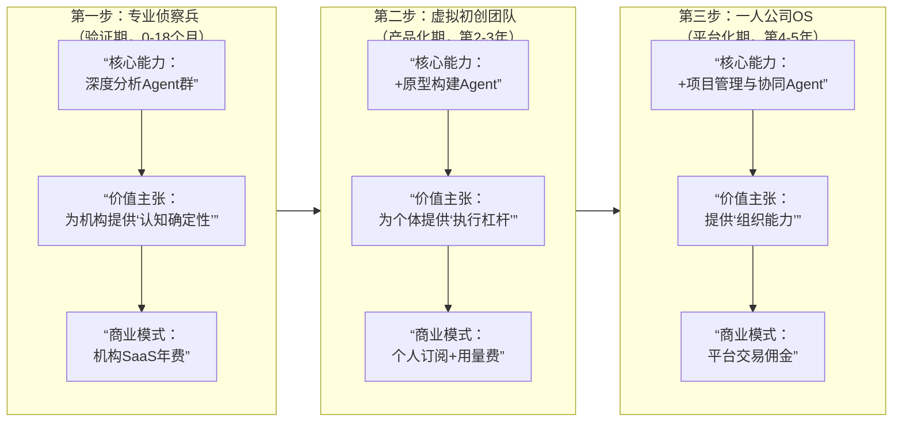

### **“创意时代第一个操作系统”项目立项报告**

#### **摘要：定义创意价值化的新范式**

我们正处在AI从“对话工具”向“行动伙伴”跃迁的奇点。本项目旨在构建一个名为“CreatorOS”的创意价值化操作系统，它既是**创意领域第一个标准化的“价值发现协议”**，也是**第一支可被雇佣的“数字员工团队”**。项目将分三步走：初期作为“创意CTO”，为投资机构与内部创新团队提供科学的创意筛选与增强服务；中期成为“虚拟初创公司”，验证想法可行性；最终演化为支持“一人公司”的完整数字组织基础设施。我们不仅出售软件，更在出售**经过算法验证的“认知确定性”与“组织能力”**。

---

### **第一部分：战略背景与机遇——从“创意通胀”到“价值发现”**

**1. 核心痛点：组织与时代的认知失调**

- **创意通胀，价值通缩**：在AIGC工具普及下，创意的产生成本趋近于零，导致信息过载。但评估创意价值的模式仍停留在前AI时代——依赖少数专家的经验、耗时的手动调研与充满偏见的会议讨论。**核心矛盾是：创意的工业化生产与手工作坊式评估之间的巨大断层**。
- **投资与创新的双重盲目**：对早期投资机构而言，面临“项目海洋”中难以系统化筛选、评估标准不透明的困境。对企业内部创新部门，大量员工创意被官僚流程湮没，无法快速验证。**真正的痛点不是缺乏创意，而是缺乏一个高效、客观、可扩展的“创意价值发现引擎”**。

**2. 市场趋势：Agentic AI开启“数字劳动力”红利窗口**

- **技术拐点已至**：大语言模型从“模式识别”进入“复杂推理与规划”阶段。根据行业共识，AI智能体正从实验室Demo走向工程实践，其标志是能**遵循规则、调用工具、完成复杂任务链**。这为我们构建专业化“数字员工”提供了前所未有的技术可行性。
- **市场认知临界点**：头部科技公司已全面转向Agentic AI（如OpenAI的“助理API”，Google的“Gemini Agents”），创业者与投资人正在急切寻找该范式下的杀手级应用。此时介入，恰是**定义品类、建立认知的黄金窗口期**。
- **经济范式演进**：全球范围内，个体创造力崛起与组织形态扁平化趋势明显。“一人公司”与分布式团队成为新常态，其核心瓶颈在于个人能力边界。市场急需能将想法直接对接至执行能力的“能力杠杆平台”。

**3. 我们的机遇：成为创意价值链的“定价中枢”**
在创意产生（AIGC工具）与创意实现（无代码平台、外包市场）之间，存在一个巨大的、未被数字化和标准化的空白地带：**创意的评估、增强与可行性规划**。

- **横向机遇（工具价值）**：为机构客户提供一套碾压传统人工评审的效率工具，将“创意初筛-分析-比价”的周期从天级压缩至分钟级。
- **纵向机遇（平台价值）**：通过积累的高质量“创意-分析-验证结果”数据闭环，训练出全球最专业的创意评估AI，形成**客观的“创意信用评分”体系**，最终成为连接创意、人才与资本的可信中介与定价中枢。

---

### **第二部分：产品愿景与定位——你的第一支数字军团**

**1. 顶层愿景**
**成为智能经济时代创意资本化的基础设施**。让任何有价值的创意，都能获得与之匹配的、基于算法的“数字能力”支持，从而实现价值的民主化创造与分配。

**2. 产品愿景**
**CreatorOS：不止是工具，更是你可配置、可雇佣的“数字联合创始人”团队。** 它由一个高度协同的AI Agent集群驱动，能够理解商业意图、执行专业分析、发起验证行动，将用户从“孤独的思考者”转变为“军队的指挥官”。

**3. 产品定位与核心理念**

- **定位**：面向**专业创造者、早期投资机构、企业创新中心**的“创意增强与决策智能”平台。它首先是一个生产力工具，终极形态是一个生产关系平台。
- **核心理念**：**结构化是最高效的创造力，可计算的流程是最可信的决策力。** 我们通过将模糊的创意转化为机器可理解、可操作的“任务工单”，释放系统性的创新力量。

**4. 价值主张**

- **对投资人/创新总监**：“用一支永不疲倦、绝对理性的‘数字分析师团队’，7x24小时扫描项目海洋，为你提供附带竞品对比、差异化和风险评估的深度预审报告，让你的决策快人三步。”
- **对创业者/个体**：“以每月一杯咖啡的费用，雇佣一个包含‘产品经理、市场分析师、技术顾问’的数字团队，为你完善想法、验证市场，甚至构建出第一个可演示的原型，让创业从‘我有一个想法’直接跃迁至‘我有一个经过验证且差异化的方案’。”

---

### **第三部分：五看三定——系统性战略洞察与抉择**

#### **（一）五看系统洞察**

1.  **看行业/趋势**：软件产业正经历从“功能自动化”到“决策自动化”再到“组织自动化”的三级跳。AI Agent是承载这一跃迁的核心载体。据信通院等机构预测，到2025年，全球AI软件市场中，具备自主任务完成能力的Agent类应用占比将超过30%，是增长最快的细分赛道。

2.  **看市场/客户**：
    - **机构客户（投资机构/大企业战投部）**：付费能力强，决策链条清晰，核心需求是**提升决策效率与质量、建立系统性项目源优势**。他们需要的是标准化的分析输出（如TS、立项报告），而非开放式的对话。
    - **个体客户（创业者/产品经理）**：付费意愿与能力呈两极分化，但数量庞大，是生态活力的源泉。他们的核心需求是**降低验证成本、获得专业背书、找到起步路径**。

3.  **看竞争**：采用战略控制点模型分析，竞争是分层的：

    ```
    高控制点 <--------------------------------------> 低控制点
    【协议/生态层】“创意评估标准” - 无人占据，是我们的战略高地。
    【复杂系统层】“多Agent工作流引擎” - 少数AI初创公司在探索，但未聚焦创意领域。是我们的核心战场。
    【功能应用层】“AI对话/分析” - ChatGPT等通用助手及Notion AI等嵌入式工具。它们提供“对话”，我们提供“交付物”；它们解决“是什么”，我们解决“怎么做”。
    ```

    **结论**：我们通过向上构建协议、向下深化工作流，与应用层对手实现**维度差异**。

4.  **看自己（假设与规划）**：
    - **优势**：清晰、前瞻的战略聚焦；对创意价值链的深刻解构；轻量敏捷的启动能力。
    - **劣势**：缺乏行业品牌声誉；初始阶段高质量训练数据匮乏；复杂系统工程的开发风险。
    - **关键假设**：我们假设专业机构愿意为显著提升的筛选效率付费；假设创业者信任AI生成的差异化分析与建议。

5.  **看机会**：最大的战略机会是**在“创意评估”这一关键但空白的环节，率先实现产品化、标准化，并积累形成“数据-算法-反馈”的飞轮**。一旦飞轮启动，后来者将难以在分析准确性和行业Know-how上追赶。

#### **（二）三定关键战略决策**

1.  **定战略控制点**：
    - **首要控制点**：**“创意价值评估模型”的准确性与专业性**。这是产品价值的根基，需要通过吸纳领域专家（投资人、产品专家）的思维框架进行训练，并持续用真实投资结果反馈调优。
    - **核心护城河**：**“多Agent协同工作流”的工程实现与稳定性**。将创意分析拆解为由不同Agent负责的标准化子任务（如市场分析Agent、竞品比对Agent、模式设计Agent），并实现可靠编排，构成极高的技术工程壁垒。
    - **生态壁垒**：**基于评估结果形成的“创意-资源”连接网络**。当大量优质项目因我们的评估而获得关注或融资时，平台将成为价值分配的关键节点。

2.  **定目标**：
    - **北极星指标**：**平台产出的“创意分析报告”被采纳并直接促成真实资源匹配（如内部立项、获得投资）的成功率**。这直接衡量我们创造的核心价值。
    - **阶段目标**：
      - **验证期（12个月）**：签约3-5家早期投资机构或企业创新部作为灯塔客户，通过服务他们跑通MVP，实现分析报告人工采纳率>60%。
      - **产品化期（第2年）**：将服务产品化为标准SaaS，付费机构客户达50家，个体用户超10万。
      - **平台化期（第3-4年）**：启动“数字员工”市场与资源对接平台，平台年度促成资源匹配总额突破1亿美元。

3.  **定策略**：
    - **楔子策略**：以**“为投资机构提供自动化项目初筛与分析报告”** 作为最锋利、最刚需的楔子，打入市场。利用机构客户的专业需求打磨核心Agent能力，并积累宝贵的数据与信誉。
    - **渗透策略**：将经过机构验证的分析能力，降维打包为“创业者版”SaaS，向广大创业者渗透，同时反哺更多数据。
    - **平台策略**：在积累足够多的已验证项目和需求方后，自然开放“数字员工”雇佣与任务众包市场，完成生态闭环。

---

### **第四部分：产品架构与解决方案**

**1. 整体架构：三层飞轮式系统**
系统设计为彼此驱动的三层，确保增长飞轮的形成：

- **协议层（价值发现层）**：定义“创意结构化描述语言”与“分析报告模板标准”。这是系统的**交互语言与价值标尺**。
- **智能体层（价值创造层）**：核心是由多个专业Agent组成的“虚拟智库”。
  - **苏格拉底Agent**：负责交互，将模糊想法结构化。
  - **分析师Agent群**：分别负责市场规模、竞争格局、用户痛点、技术趋势等垂直分析。
  - **合成Agent**：整合所有分析，生成符合机构要求的、带有明确结论和建议（如“推荐深入尽调”、“建议放弃”）的**最终报告**。
- **数据层（价值进化层）**：存储所有“创意-分析-后续真实世界结果”的数据。用结果反哺训练Agent，形成**越用越准的飞轮**。

**2. 产品演进路线：三步构筑帝国**
产品能力将严格遵循从“辅助”到“协同”再到“自治”的路径演进，其核心价值与商业模式也随之深化：



---

### **第五部分：商业模式——为确定性、杠杆与生态付费**

1.  **机构订阅制（初期核心）**：提供阶梯式年费套餐，按每月可分析的创意数量、报告深度、团队席位收费。客单价瞄准5万-20万美元/年。
2.  **个人创作者订阅制（中期增长）**：提供月度/年度订阅，包含基础分析次数。高级功能如“原型生成”按次或积分包收费。
3.  **平台交易佣金（长期引擎）**：当平台促成融资、人才雇佣、服务采购时，收取1%-3%的成交佣金。这是平台生态价值的直接变现。

---

### **第六部分：实施路线图（24个月关键里程碑）**

- **Phase 1：概念验证（Months 1-6）**
  - **目标**：与1-2家合作伙伴深度绑定，以人工+AI辅助的方式，跑通“创意输入-结构化-分析-报告”全流程。
  - **交付**：定制化分析流程；定义核心数据协议v0.5。
- **Phase 2：MVP开发（Months 7-12）**
  - **目标**：开发出第一个自动化分析引擎，服务3-5家灯塔客户。
  - **交付**：具备核心Agent群的内部版CreatorOS；产出至少100份被客户实际使用的分析报告。
- **Phase 3：产品化与扩张（Months 13-24）**
  - **目标**：发布标准化的机构版SaaS，开始拓展个人用户市场。
  - **交付**：公开上线的机构SaaS平台；发布个人版MVP；累计付费机构客户超20家。

---

### **第七部分：成功度量体系——衡量我们创造的真实影响**

1.  **核心价值指标**：
    - **报告采纳率**：客户直接使用（或仅做微调）我们生成的分析报告的比例。
    - **价值验证率**：经我们分析并推荐的项目，最终获得内部资源或外部投资的比例。
    - **用户效率提升**：客户反馈的创意评估周期缩短百分比。
2.  **产品健康指标**：
    - **机构客户**：NDR（净收入留存率）> 120%，Logo留存率 > 90%。
    - **个体用户**：月活跃用户增长率，付费转化率。
3.  **技术壁垒指标**：
    - **Agent任务成功率**：分析任务链完整执行无误的比例。
    - **数据飞轮速度**：月度新增的“创意-真实结果”配对数据量。

---

**结语：抓住组织智能化的历史进程**
我们项目的本质，是将人类最高价值的活动——“创新与决策”——的一部分，转化为可编程、可扩展、可优化的智能过程。这并非替代人类，而是**增强人类的战略性思考能力**。在AI Agent从实验室走向产业化的黎明时刻，构建“创意时代的第一个操作系统”，不仅是一门伟大的生意，更是参与塑造未来工作与创造范式的历史性机遇。我们邀请您，共同成为这个新范式的定义者。
