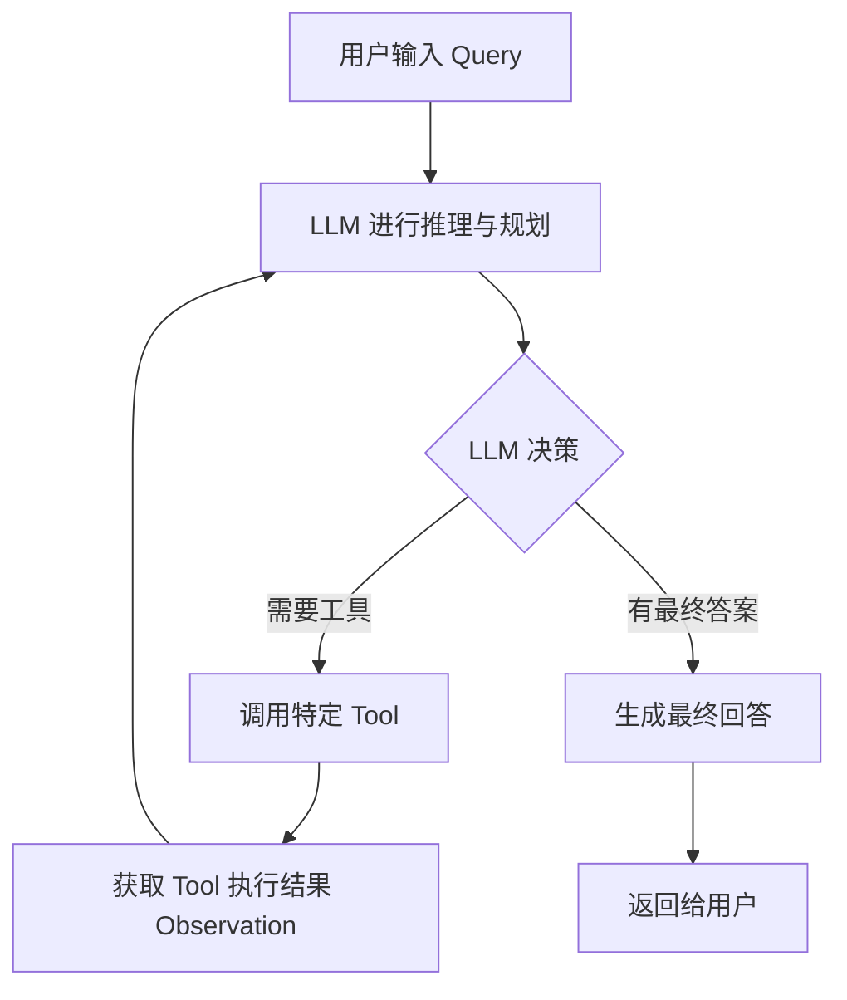
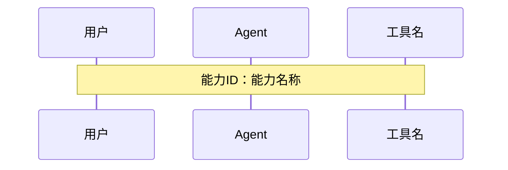

# 📘 Agent 项目战略设计标准

---

## 🧭 目录

- [第一部分：战略目标与域划分](#第一部分战略目标与域划分)
  - [1.1 战略建模的目标](#11-战略建模的目标)
  - [1.2 子域划分与分析](#12-子域划分与分析)
- [第二部分：设计哲学与模式原则](#第二部分设计哲学与模式原则)
  - [2.1 能力驱动与流程驱动的对比](#21-能力驱动与流程驱动的对比)
  - [2.2 ReAct Loop + LLM 模式原则](#22-react-loop--llm-模式原则)
  - [2.3 常见设计误区](#23-常见设计误区)
- [第三部分：实现标准](#第三部分实现标准)
  - [3.1 Prompt 构造块设计原则](#31-prompt-构造块设计原则)
  - [3.2 工具设计原则](#32-工具设计原则)
  - [3.3 用户用例设计原则](#33-用户用例设计原则)
- [附录A：特别注意事项](#附录a特别注意事项)

---

## 第一部分：战略目标与域划分

### 1.1 战略建模的目标

区分出 Agent 项目的 **核心域**、**支撑域**、**通用域**，从而指导 **资源投入** 与 **技术决策**。

---

### 1.2 子域划分与分析

#### 核心域、支撑域、通用域的定义对比

| 划分项 | 对应子域类型 | 分析 |
|-----------|--------------|------|
| **核心域：Prompt 定义 + 工具定义** | 核心域 | Prompt 决定思考模式与对话风格，是 Agent 的灵魂；工具定义决定技能边界，二者构成核心竞争力。 |
| **支撑域：工具的具体实现** | 支撑域 | 工具实现是业务定制逻辑，支撑核心域能力实现。虽然重要，但技术选型不是客户关注点。 |
| **通用域：大模型接口、数据仓库接口、用户认证** | 通用域 | 这些是行业通用基础设施，应优先采用成熟的现成方案，而不是投入自研。 |

---

## 第二部分：设计哲学与模式原则

### 2.1 能力驱动与流程驱动的对比

#### 📊 核心思想
> 传统软件是“流程驱动”的：用户遵循系统；  
> AI Agent 是“能力驱动”的：系统理解用户。

#### 对比表

| 维度 | 流程驱动的传统软件 | 能力驱动的 AI Agent |
|------|------------------|------------------|
| 核心范式 | 预定义流程 (If-Then 规则) | 动态意图识别与满足 (Goal-Action) |
| 交互模式 | 线性、菜单式 | 非线性、对话式 |
| 状态管理 | 显式状态机（步骤2/5） | 隐式上下文，由 Agent 维护 |
| 用户自由度 | 低：固定路径 | 高：可随时切换话题、追问 |
| 系统智能体现 | 精确执行，行为可预测 | 灵活应对模糊、跳跃输入 |
| 错误处理 | 脆弱，偏离输入即报错 | 鲁棒，能追问澄清 |
| 设计重心 | 设计最优路径 | 定义能力与边界 |
| 数据依赖 | 结构化输入 | 自然语言、文档、图片 |
| 用户体验类比 | 自动售票机 | 酒店礼宾 |
| 适用场景 | 高频、标准化任务 | 复杂、创意性任务 |

---

### 2.2 ReAct Loop + LLM 模式原则

#### 📘 原则说明

充分信任 LLM 的推理和决策能力，让其主导 ReAct 循环：  
“推理 → 规划 → 调用工具 → 获取反馈 → 再推理”。

---

### 2.3 常见设计误区

> **错误模式：** 人为增加硬匹配逻辑，削弱 LLM 推理能力

LLM 本身具备意图识别与反思能力，不要使用正则、关键词等“流程式”方式匹配意图或工具，这些应交由 ReAct Loop 自动完成

---

## 第三部分：实现标准

### 3.1 Prompt 构造块设计原则

#### 定义

> 构造块是 Prompt 的组成单元，每个块都是独立的信息块，共同组成完整的 Agent Prompt。

#### 构造块组成

- 🧩 **角色定义**：Agent 的身份与定位  
- 🎯 **目标定义**：Agent 要达成的目标（用户问题）  
- ⚙️ **核心能力定义**：Agent 具备的主要表现层能力  
- 📜 **特殊要求定义**：业务特定要求或约束

#### 构造块原则

- **目标完备性**：目标能全面满足用户需求  
- **能力完备性**：能力组合可完全支撑目标

---

### 3.2 工具设计原则

#### 三大核心原则

1. 🧠 **完美模型假设**  
   假设 LLM 的理解与上下文能力是完美的。
2. 🧩 **必要性**  
   如果在没有该工具的前提下，大模型根据上下文信息可以推理出等效工具调用的结果，则工具不具备必要性，反之具备
3. 🔗 **完备性**  
   即当前的工具集+LLM自身的推理能力，必须能组合出Agent所有能力

#### 工具定义模板

**[工具名称]**
- **介绍**：简述工具的核心功能  
- **参数**：输入参数定义与说明  
- **返回**：返回结果的格式与含义

---

### 3.3 用户用例设计原则

#### 能力响应原则

展示 Agent 如何通过能力响应用户需求，  
使用时序图表达 Agent、用户、工具间的交互。

---

## 附录A：特别注意事项

> 以下为 Agent 设计中最容易出错的地方，请逐项核查：

- ✅ **完美模型假设**：假设模型理解力完备  
- ✅ **必要性**：工具确有必要存在  
- ✅ **完备性**：Agent 能力覆盖业务全部场景  

> ⚠️ 请严格遵循文档格式，避免添加主观解释或额外逻辑

---

🧾 **说明**：  
本文件为 Agent 战略设计指导文档，适用于核心域定义、工具体系规划、Prompt 构造及用例验证阶段
