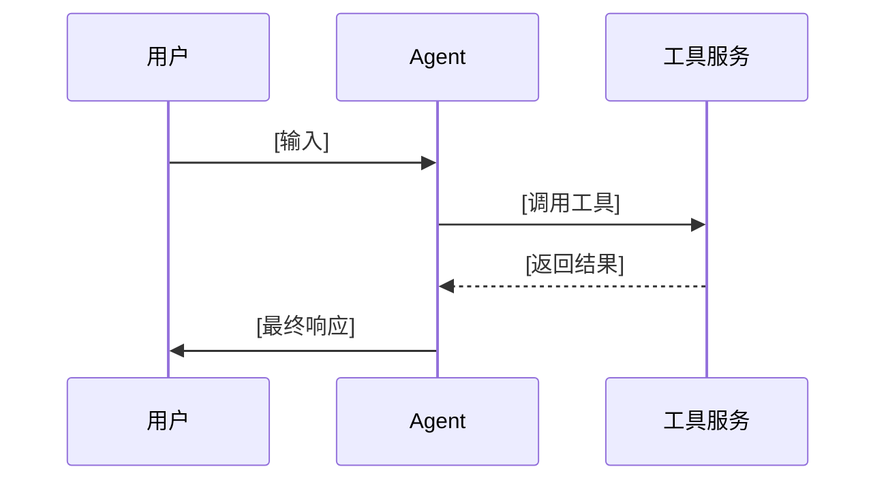

# [产品名称] Agent 产品需求文档

## 文档基础信息

**文档编号**：PRD-AGENT-[项目代号]-[版本号]
**产品名称**：[产品名称]
**产品类型**：AI Agent 应用
**目标用户**：[目标用户群体]
**核心价值**：[一句话核心价值，例如：通过 Agent 实现...，降低...，提升...]

---

## 1. 产品概述 (Product Overview)

### 1.1 背景 (Background)

[描述项目背景，痛点，以及为什么要引入 Agent 技术。]

### 1.2 目标 (Objectives)

* **业务目标**：
  * [目标1]
  * [目标2]
* **用户体验目标**：
  * [目标1]
  * [目标2]

### 1.3 范围 (Scope)

[描述产品的主要覆盖范围，涉及的角色和核心流程。]

### 1.4 MVP 范围说明 (MVP Scope)

[如果适用，描述 MVP 阶段的聚焦范围和裁剪策略。]

* **主要策略**：
* **不包含**：

---

## 2. Agent 核心定义 (Agent Core Definition)

### 2.1 角色定义 (Roles)

| 角色 | 描述 | 职责 |
| :--- | :--- | :--- |
| **[角色1]** | [简述] | [职责详细描述] |
| **[User]** | [简述] | [职责详细描述] |

### 2.2 身份与提示词 (Prompts)

#### [Agent 角色名称]

> **身份定义**：[描述 Agent 的身份、语气、性格]
>
> **工作原则**：
>
> 1. [原则1]
> 2. [原则2]
>
> **边界限制**：
>
> 1. [限制1]
> 2. [限制2]

### 2.3 工作方法 (Methodology)

1. **[方法1]**：[例如 ReAct 模式]
2. **[方法2]**：[例如 Capability-Driven]
3. **[策略]**：[例如 FAQ 优先策略]

#### 交互策略

1. **[场景1]**：[策略描述]
2. **[场景2]**：[策略描述]

---

## 3. 功能与工具概览 (Feature & Tool Overview)

### 3.1 功能需求总览表 (Feature Requirements Table)

| 模块名称 | 功能ID | 功能名称 | 功能描述 | 优先级 | 逻辑实现 | 用户故事关联 | 备注 |
| :--- | :--- | :--- | :--- | :--- | :--- | :--- | :--- |
| **[模块1]** | F-1.1 | [功能名] | [描述] | [优先级] | [简述实现逻辑] | [US-ID] | [备注] |

### 3.2 工具定义表 (Tool Definitions)

| 工具名称 | 描述 | 关键输入 | 关键输出 |
| :--- | :--- | :--- | :--- |
| **[tool_name]** | [工具描述] | `arg1`, `arg2` | `result_field` |

---

## 4. Agent 核心流程 (Agent Logic & Processes)

### 4.1 主流程 (Main Process)

**1. [流程名称]**
[详细的文字描述流程步骤，Agent 和工具的交互细节。]

### 4.2 流程图 (Diagrams)

**流程1：[流程名称]**

---

## 5. Agent 工具与功能规格 (Detailed Tool Specifications)

> 说明：本章将《功能需求文档》中的功能点（F-x.x）完整映射到 Agent 的工具定义中。

### 5.1 [工具名称/类别]：`[tool_function_name]`

**描述**：[工具详细描述]
**对应的功能点详情**：

#### F-x.x [功能名称]

* **功能描述**：[详细描述]
* **API设计约束**：
  * [约束1]
  * [约束2]
* **业务功能约束**：
  * [约束1]
* **业务规则**：
  * [规则1]
* **安全/体验约束**：
  * [约束1]

---

## 6. 交互设计 (Interaction Design)

### 6.1 Agent 核心 UI 交互

**输入输出组件**：

1. **[组件名]**：[描述]
2. **[组件名]**：[描述]

**历史对话管理**：

* [规则1]

### 6.2 Agent 支撑 UI 交互

**系统设置**：

* [设置项]

**反馈机制**：

* [机制描述]

---

## 7. 实施与非功能需求 (Implementation & Non-Functional Requirements)

### 7.1 非功能需求 (Non-Functional Requirements)

* **准确性 (Accuracy)**：[指标]
* **响应速度 (Latency)**：[指标]
* **并发能力 (Concurrency)**：[指标]
* **数据安全 (Security)**：[指标]

### 7.2 实施要求 (Implementation Requirements)

**部署要求**：

* **架构**：[描述]
* **环境**：[描述]

**测试要求**：

1. **功能测试**：[测试点]
2. **验收标准**：[标准]

**安全要求**：

* [要求]

---

## 8. 附录 (Appendix)

### 8.1 术语表

| 术语 | 定义 | 说明 |
| :--- | :--- | :--- |
| **[术语]** | [全称] | [解释] |

### 8.2 参考文档

1. [文档名]
